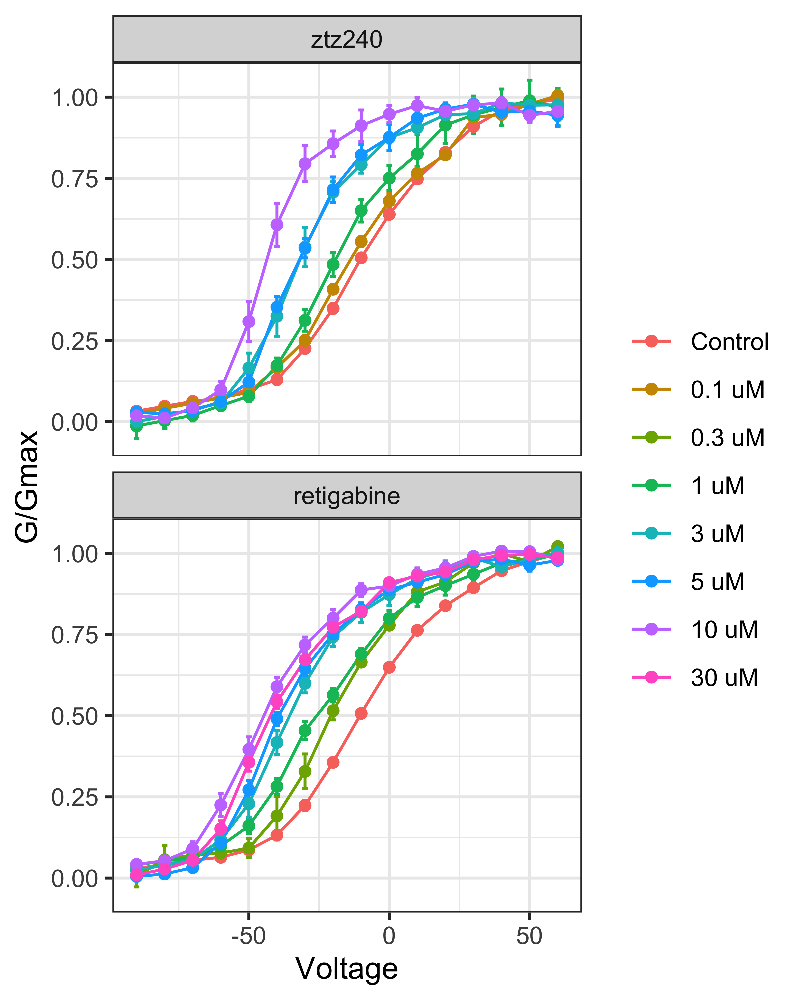
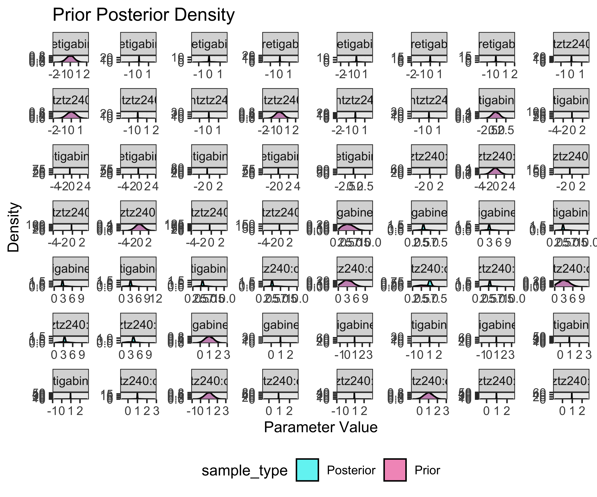
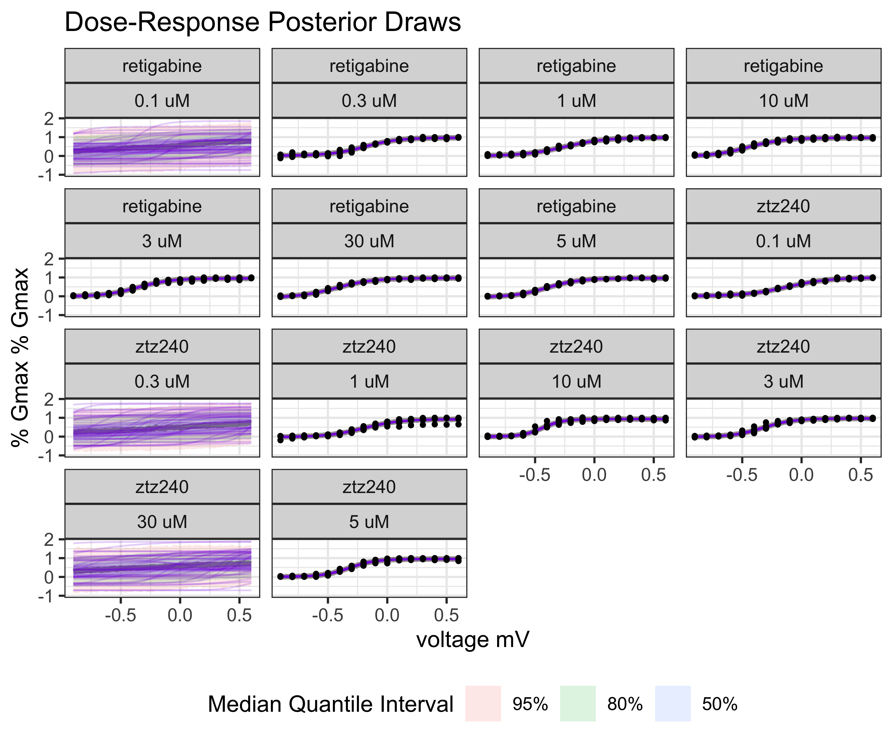

# Re-analysis Figure 1 of (Li, et al., 2021) Molecular Basis for Ligand Activation of the Human KCNQ2 Channel

KCNQ2 is a voltage gated potassium channel important for re-establishing neuronal homeostasis following an action potential. Dis-regulation of channels in the KCNQ family can cause epilepsy, tinnitus, and depression. While there has been sustained interest in developing small-molecule based therapeutics targeting KCNQ2, the only FDA approved drug that targets KCNQ2, retigabine, was given a black-box warning due to unwanted side-effects, even though it was effective at treating epilepsy. Excitingly there has been recent progress in using Cryo-EM to structurally characterize ion channels including KCNQ2, which promise to support structure-based drug design.

Recently, [@Li2021-ef] used Cryo-EM to characterize the structure of KCNQ2 in complex with retigabine, which interacts in the membrane on the outside of the pore, and ztz240, which interacts with the voltage sensor domain. To relate the structure and function, [@Li2021-ef] measured conductance as a function of voltage (G-V curves) in the presence of varying doses of retigabine and ztz240 using whole cell patch-clamp electrophysiology in Chinese hamster ovary (CHO)-K1 cells overexpressing KCNQ2. Both compounds are thought to be agonists, that is with increasing concentration of drug, less negative voltages are required to open the channel.

In this case study, the aim is to re-analyze the effects of retigabine and ztz240 using the data collected in [@Li2021-ef] and presented in panels B and D of figure 1. A key idea is to recognize that voltage and drug treatment can be thought of independent perturbations and the drug effect can be framed as characterizing the interaction between these perturbations.

To begin, we will load and plot the data,


```
## # A tibble: 1,856 × 6
##    treatment dose_uM is_control voltage replica   conductance
##    <chr>       <dbl> <lgl>        <dbl> <chr>           <dbl>
##  1 ztz240         10 TRUE           -90 replica_1      0.0403
##  2 ztz240         10 TRUE           -90 replica_2      0.0632
##  3 ztz240         10 TRUE           -90 replica_3      0.0200
##  4 ztz240         10 TRUE           -90 replica_4      0.0404
##  5 ztz240         10 TRUE           -90 replica_5      0.0175
##  6 ztz240         10 TRUE           -80 replica_1      0.0469
##  7 ztz240         10 TRUE           -80 replica_2      0.0682
##  8 ztz240         10 TRUE           -80 replica_3      0.0345
##  9 ztz240         10 TRUE           -80 replica_4      0.0574
## 10 ztz240         10 TRUE           -80 replica_5      0.0339
## # ℹ 1,846 more rows
```


<div class="figure" style="text-align: center">

<p class="caption">plot of chunk reproduce-fig1</p>
</div>
Then, for each treatment and dose, we will fit a sigmoid curve, which has an comparable functional form to the what they call the Boltzmann equation for G/Gmax as a function of voltage. To make the fitting more stable, we will transform the treatment and response scales.


```r
model_conductance <- BayesPharma::sigmoid_model(
  data = model_data,
  formula = BayesPharma::sigmoid_agonist_formula(
    treatment_variable = "voltage",
    treatment_units = "mV",
    response_variable = "conductance",
    response_units = "% Gmax",
    predictors = 0 + treatment:doselabel),
  prior = BayesPharma::sigmoid_agonist_prior(
    ec50 = brms::prior(normal(-0.2, 1), nlpar = "ec50"),
    hill = brms::prior(normal(3, 2), nlpar = "hill", lb = 0)),
  init = BayesPharma::sigmoid_agonist_init(
    ec50 = \() runif(1, min = -7, max = -5),
    hill = \() runif(1, min = 0.8, max = 1.2),
    bottom = \() runif(1, min = -.1, max = 0.1),
    top = \() runif(1, min = 0.8, max = 1.2)),
  cores = 4)
```

```
##  Family: gaussian 
##   Links: mu = identity; sigma = identity 
## Formula: conductance ~ sigmoid(ec50, hill, top, bottom, voltage) 
##          ec50 ~ 0 + treatment:doselabel
##          hill ~ 0 + treatment:doselabel
##          top ~ 0 + treatment:doselabel
##          bottom ~ 0 + treatment:doselabel
##    Data: data (Number of observations: 928) 
##   Draws: 4 chains, each with iter = 8000; warmup = 4000; thin = 1;
##          total post-warmup draws = 16000
## 
## Population-Level Effects: 
##                                           Estimate Est.Error l-95% CI u-95% CI
## ec50_treatmentretigabine:doselabel0.1uM      -0.21      1.00    -2.17     1.74
## ec50_treatmentztz240:doselabel0.1uM          -0.12      0.01    -0.14    -0.09
## ec50_treatmentretigabine:doselabel0.3uM      -0.19      0.01    -0.21    -0.17
## ec50_treatmentztz240:doselabel0.3uM          -0.20      1.00    -2.17     1.76
## ec50_treatmentretigabine:doselabel1uM        -0.25      0.01    -0.28    -0.22
## ec50_treatmentztz240:doselabel1uM            -0.19      0.01    -0.22    -0.17
## ec50_treatmentretigabine:doselabel10uM       -0.45      0.01    -0.48    -0.43
## ec50_treatmentztz240:doselabel10uM           -0.44      0.01    -0.45    -0.42
## ec50_treatmentretigabine:doselabel3uM        -0.36      0.01    -0.38    -0.33
## ec50_treatmentztz240:doselabel3uM            -0.32      0.01    -0.34    -0.30
## ec50_treatmentretigabine:doselabel30uM       -0.43      0.01    -0.46    -0.40
## ec50_treatmentztz240:doselabel30uM           -0.20      0.99    -2.15     1.73
## ec50_treatmentretigabine:doselabel5uM        -0.40      0.01    -0.42    -0.37
## ec50_treatmentztz240:doselabel5uM            -0.32      0.01    -0.34    -0.30
## hill_treatmentretigabine:doselabel0.1uM       3.28      1.75     0.34     6.98
## hill_treatmentztz240:doselabel0.1uM           2.48      0.21     2.08     2.91
## hill_treatmentretigabine:doselabel0.3uM       3.02      0.24     2.58     3.53
## hill_treatmentztz240:doselabel0.3uM           3.28      1.75     0.32     6.96
## hill_treatmentretigabine:doselabel1uM         2.56      0.21     2.16     3.00
## hill_treatmentztz240:doselabel1uM             2.85      0.21     2.46     3.28
## hill_treatmentretigabine:doselabel10uM        2.89      0.24     2.45     3.38
## hill_treatmentztz240:doselabel10uM            4.99      0.44     4.20     5.92
## hill_treatmentretigabine:doselabel3uM         3.11      0.26     2.63     3.66
## hill_treatmentztz240:doselabel3uM             3.39      0.27     2.89     3.96
## hill_treatmentretigabine:doselabel30uM        2.77      0.22     2.36     3.23
## hill_treatmentztz240:doselabel30uM            3.25      1.76     0.30     6.98
## hill_treatmentretigabine:doselabel5uM         3.12      0.26     2.65     3.66
## hill_treatmentztz240:doselabel5uM             3.88      0.30     3.33     4.50
## top_treatmentretigabine:doselabel0.1uM        1.00      0.50     0.03     1.96
## top_treatmentztz240:doselabel0.1uM            0.99      0.02     0.95     1.04
## top_treatmentretigabine:doselabel0.3uM        0.97      0.02     0.94     1.00
## top_treatmentztz240:doselabel0.3uM            1.00      0.51     0.00     2.00
## top_treatmentretigabine:doselabel1uM          0.98      0.02     0.95     1.01
## top_treatmentztz240:doselabel1uM              0.93      0.01     0.90     0.96
## top_treatmentretigabine:doselabel10uM         0.96      0.01     0.94     0.99
## top_treatmentztz240:doselabel10uM             0.93      0.01     0.91     0.95
## top_treatmentretigabine:doselabel3uM          0.95      0.01     0.93     0.98
## top_treatmentztz240:doselabel3uM              0.96      0.01     0.94     0.99
## top_treatmentretigabine:doselabel30uM         0.96      0.01     0.94     0.99
## top_treatmentztz240:doselabel30uM             1.00      0.50     0.01     1.98
## top_treatmentretigabine:doselabel5uM          0.96      0.01     0.94     0.99
## top_treatmentztz240:doselabel5uM              0.95      0.01     0.93     0.97
## bottom_treatmentretigabine:doselabel0.1uM    -0.00      0.50    -0.98     0.99
## bottom_treatmentztz240:doselabel0.1uM         0.01      0.02    -0.03     0.04
## bottom_treatmentretigabine:doselabel0.3uM     0.02      0.02    -0.02     0.05
## bottom_treatmentztz240:doselabel0.3uM         0.00      0.50    -0.97     0.97
## bottom_treatmentretigabine:doselabel1uM       0.00      0.02    -0.04     0.05
## bottom_treatmentztz240:doselabel1uM          -0.02      0.02    -0.06     0.01
## bottom_treatmentretigabine:doselabel10uM     -0.04      0.03    -0.10     0.02
## bottom_treatmentztz240:doselabel10uM         -0.00      0.02    -0.04     0.03
## bottom_treatmentretigabine:doselabel3uM      -0.01      0.02    -0.06     0.03
## bottom_treatmentztz240:doselabel3uM          -0.02      0.02    -0.06     0.02
## bottom_treatmentretigabine:doselabel30uM     -0.07      0.03    -0.13    -0.02
## bottom_treatmentztz240:doselabel30uM         -0.00      0.50    -0.98     0.97
## bottom_treatmentretigabine:doselabel5uM      -0.05      0.03    -0.11    -0.00
## bottom_treatmentztz240:doselabel5uM           0.00      0.02    -0.03     0.04
##                                           Rhat Bulk_ESS Tail_ESS
## ec50_treatmentretigabine:doselabel0.1uM   1.00    34783    11068
## ec50_treatmentztz240:doselabel0.1uM       1.00    25288    11223
## ec50_treatmentretigabine:doselabel0.3uM   1.00    24792    11852
## ec50_treatmentztz240:doselabel0.3uM       1.00    35485    11480
## ec50_treatmentretigabine:doselabel1uM     1.00    25280    12104
## ec50_treatmentztz240:doselabel1uM         1.00    25026    11198
## ec50_treatmentretigabine:doselabel10uM    1.00    17942    11644
## ec50_treatmentztz240:doselabel10uM        1.00    23346    12379
## ec50_treatmentretigabine:doselabel3uM     1.00    22956    12199
## ec50_treatmentztz240:doselabel3uM         1.00    24904    11832
## ec50_treatmentretigabine:doselabel30uM    1.00    20528    11891
## ec50_treatmentztz240:doselabel30uM        1.00    33097    10886
## ec50_treatmentretigabine:doselabel5uM     1.00    22066    10918
## ec50_treatmentztz240:doselabel5uM         1.00    24969    11622
## hill_treatmentretigabine:doselabel0.1uM   1.00    11316     6605
## hill_treatmentztz240:doselabel0.1uM       1.00    16130    11554
## hill_treatmentretigabine:doselabel0.3uM   1.00    18195    11964
## hill_treatmentztz240:doselabel0.3uM       1.00    10769     5702
## hill_treatmentretigabine:doselabel1uM     1.00    16991    11091
## hill_treatmentztz240:doselabel1uM         1.00    18318    10961
## hill_treatmentretigabine:doselabel10uM    1.00    14215    10879
## hill_treatmentztz240:doselabel10uM        1.00    21265    13050
## hill_treatmentretigabine:doselabel3uM     1.00    18021    12448
## hill_treatmentztz240:doselabel3uM         1.00    19661    12961
## hill_treatmentretigabine:doselabel30uM    1.00    15569    10928
## hill_treatmentztz240:doselabel30uM        1.00    10709     6219
## hill_treatmentretigabine:doselabel5uM     1.00    16213    10503
## hill_treatmentztz240:doselabel5uM         1.00    21759    12512
## top_treatmentretigabine:doselabel0.1uM    1.00    31311    10887
## top_treatmentztz240:doselabel0.1uM        1.00    16792    10851
## top_treatmentretigabine:doselabel0.3uM    1.00    19113    12309
## top_treatmentztz240:doselabel0.3uM        1.00    33295    10303
## top_treatmentretigabine:doselabel1uM      1.00    20687    11878
## top_treatmentztz240:doselabel1uM          1.00    20688    11449
## top_treatmentretigabine:doselabel10uM     1.00    22627    13010
## top_treatmentztz240:doselabel10uM         1.00    26273    13117
## top_treatmentretigabine:doselabel3uM      1.00    21977    12626
## top_treatmentztz240:doselabel3uM          1.00    23135    12228
## top_treatmentretigabine:doselabel30uM     1.00    20546    12915
## top_treatmentztz240:doselabel30uM         1.00    34890    10813
## top_treatmentretigabine:doselabel5uM      1.00    23638    12335
## top_treatmentztz240:doselabel5uM          1.00    25793    12158
## bottom_treatmentretigabine:doselabel0.1uM 1.00    36318    11303
## bottom_treatmentztz240:doselabel0.1uM     1.00    19506    12083
## bottom_treatmentretigabine:doselabel0.3uM 1.00    20395    11791
## bottom_treatmentztz240:doselabel0.3uM     1.00    36621    11094
## bottom_treatmentretigabine:doselabel1uM   1.00    17868    11011
## bottom_treatmentztz240:doselabel1uM       1.00    18972    12351
## bottom_treatmentretigabine:doselabel10uM  1.00    14148     9853
## bottom_treatmentztz240:doselabel10uM      1.00    21253    11743
## bottom_treatmentretigabine:doselabel3uM   1.00    18186    11233
## bottom_treatmentztz240:doselabel3uM       1.00    19723    12867
## bottom_treatmentretigabine:doselabel30uM  1.00    15546    10646
## bottom_treatmentztz240:doselabel30uM      1.00    32655    10736
## bottom_treatmentretigabine:doselabel5uM   1.00    17254     9650
## bottom_treatmentztz240:doselabel5uM       1.00    21366    12002
## 
## Family Specific Parameters: 
##       Estimate Est.Error l-95% CI u-95% CI Rhat Bulk_ESS Tail_ESS
## sigma     0.06      0.00     0.06     0.06 1.00    27866    12208
## 
## Draws were sampled using sampling(NUTS). For each parameter, Bulk_ESS
## and Tail_ESS are effective sample size measures, and Rhat is the potential
## scale reduction factor on split chains (at convergence, Rhat = 1).
```


```r
model_conductance |>
  BayesPharma::plot_prior_posterior_densities()
```

```
## 
## SAMPLING FOR MODEL 'anon_model' NOW (CHAIN 1).
## Chain 1: 
## Chain 1: Gradient evaluation took 2.6e-05 seconds
## Chain 1: 1000 transitions using 10 leapfrog steps per transition would take 0.26 seconds.
## Chain 1: Adjust your expectations accordingly!
## Chain 1: 
## Chain 1: 
## Chain 1: Iteration:    1 / 2000 [  0%]  (Warmup)
## Chain 1: Iteration:  200 / 2000 [ 10%]  (Warmup)
## Chain 1: Iteration:  400 / 2000 [ 20%]  (Warmup)
## Chain 1: Iteration:  600 / 2000 [ 30%]  (Warmup)
## Chain 1: Iteration:  800 / 2000 [ 40%]  (Warmup)
## Chain 1: Iteration: 1000 / 2000 [ 50%]  (Warmup)
## Chain 1: Iteration: 1001 / 2000 [ 50%]  (Sampling)
## Chain 1: Iteration: 1200 / 2000 [ 60%]  (Sampling)
## Chain 1: Iteration: 1400 / 2000 [ 70%]  (Sampling)
## Chain 1: Iteration: 1600 / 2000 [ 80%]  (Sampling)
## Chain 1: Iteration: 1800 / 2000 [ 90%]  (Sampling)
## Chain 1: Iteration: 2000 / 2000 [100%]  (Sampling)
## Chain 1: 
## Chain 1:  Elapsed Time: 0.258 seconds (Warm-up)
## Chain 1:                0.274 seconds (Sampling)
## Chain 1:                0.532 seconds (Total)
## Chain 1: 
## 
## SAMPLING FOR MODEL 'anon_model' NOW (CHAIN 2).
## Chain 2: 
## Chain 2: Gradient evaluation took 8e-06 seconds
## Chain 2: 1000 transitions using 10 leapfrog steps per transition would take 0.08 seconds.
## Chain 2: Adjust your expectations accordingly!
## Chain 2: 
## Chain 2: 
## Chain 2: Iteration:    1 / 2000 [  0%]  (Warmup)
## Chain 2: Iteration:  200 / 2000 [ 10%]  (Warmup)
## Chain 2: Iteration:  400 / 2000 [ 20%]  (Warmup)
## Chain 2: Iteration:  600 / 2000 [ 30%]  (Warmup)
## Chain 2: Iteration:  800 / 2000 [ 40%]  (Warmup)
## Chain 2: Iteration: 1000 / 2000 [ 50%]  (Warmup)
## Chain 2: Iteration: 1001 / 2000 [ 50%]  (Sampling)
## Chain 2: Iteration: 1200 / 2000 [ 60%]  (Sampling)
## Chain 2: Iteration: 1400 / 2000 [ 70%]  (Sampling)
## Chain 2: Iteration: 1600 / 2000 [ 80%]  (Sampling)
## Chain 2: Iteration: 1800 / 2000 [ 90%]  (Sampling)
## Chain 2: Iteration: 2000 / 2000 [100%]  (Sampling)
## Chain 2: 
## Chain 2:  Elapsed Time: 0.192 seconds (Warm-up)
## Chain 2:                0.138 seconds (Sampling)
## Chain 2:                0.33 seconds (Total)
## Chain 2: 
## 
## SAMPLING FOR MODEL 'anon_model' NOW (CHAIN 3).
## Chain 3: 
## Chain 3: Gradient evaluation took 7e-06 seconds
## Chain 3: 1000 transitions using 10 leapfrog steps per transition would take 0.07 seconds.
## Chain 3: Adjust your expectations accordingly!
## Chain 3: 
## Chain 3: 
## Chain 3: Iteration:    1 / 2000 [  0%]  (Warmup)
## Chain 3: Iteration:  200 / 2000 [ 10%]  (Warmup)
## Chain 3: Iteration:  400 / 2000 [ 20%]  (Warmup)
## Chain 3: Iteration:  600 / 2000 [ 30%]  (Warmup)
## Chain 3: Iteration:  800 / 2000 [ 40%]  (Warmup)
## Chain 3: Iteration: 1000 / 2000 [ 50%]  (Warmup)
## Chain 3: Iteration: 1001 / 2000 [ 50%]  (Sampling)
## Chain 3: Iteration: 1200 / 2000 [ 60%]  (Sampling)
## Chain 3: Iteration: 1400 / 2000 [ 70%]  (Sampling)
## Chain 3: Iteration: 1600 / 2000 [ 80%]  (Sampling)
## Chain 3: Iteration: 1800 / 2000 [ 90%]  (Sampling)
## Chain 3: Iteration: 2000 / 2000 [100%]  (Sampling)
## Chain 3: 
## Chain 3:  Elapsed Time: 0.199 seconds (Warm-up)
## Chain 3:                0.272 seconds (Sampling)
## Chain 3:                0.471 seconds (Total)
## Chain 3: 
## 
## SAMPLING FOR MODEL 'anon_model' NOW (CHAIN 4).
## Chain 4: 
## Chain 4: Gradient evaluation took 1.1e-05 seconds
## Chain 4: 1000 transitions using 10 leapfrog steps per transition would take 0.11 seconds.
## Chain 4: Adjust your expectations accordingly!
## Chain 4: 
## Chain 4: 
## Chain 4: Iteration:    1 / 2000 [  0%]  (Warmup)
## Chain 4: Iteration:  200 / 2000 [ 10%]  (Warmup)
## Chain 4: Iteration:  400 / 2000 [ 20%]  (Warmup)
## Chain 4: Iteration:  600 / 2000 [ 30%]  (Warmup)
## Chain 4: Iteration:  800 / 2000 [ 40%]  (Warmup)
## Chain 4: Iteration: 1000 / 2000 [ 50%]  (Warmup)
## Chain 4: Iteration: 1001 / 2000 [ 50%]  (Sampling)
## Chain 4: Iteration: 1200 / 2000 [ 60%]  (Sampling)
## Chain 4: Iteration: 1400 / 2000 [ 70%]  (Sampling)
## Chain 4: Iteration: 1600 / 2000 [ 80%]  (Sampling)
## Chain 4: Iteration: 1800 / 2000 [ 90%]  (Sampling)
## Chain 4: Iteration: 2000 / 2000 [100%]  (Sampling)
## Chain 4: 
## Chain 4:  Elapsed Time: 0.222 seconds (Warm-up)
## Chain 4:                0.27 seconds (Sampling)
## Chain 4:                0.492 seconds (Total)
## Chain 4:
```

<div class="figure" style="text-align: center">

<p class="caption">plot of chunk model-conductance-prior-posterior</p>
</div>


```r
model_conductance |>
  BayesPharma::plot_posterior_draws()
```

<div class="figure" style="text-align: center">

<p class="caption">plot of chunk model-conductance-predictive</p>
</div>
Fit MuSyC Model


```
## Running /Library/Frameworks/R.framework/Resources/bin/R CMD SHLIB foo.c
## clang -mmacosx-version-min=10.13 -I"/Library/Frameworks/R.framework/Resources/include" -DNDEBUG   -I"/Library/Frameworks/R.framework/Versions/4.2/Resources/library/Rcpp/include/"  -I"/Library/Frameworks/R.framework/Versions/4.2/Resources/miworkspace-library/RcppEigen/include/"  -I"/Library/Frameworks/R.framework/Versions/4.2/Resources/miworkspace-library/RcppEigen/include/unsupported"  -I"/Library/Frameworks/R.framework/Versions/4.2/Resources/miworkspace-library/BH/include" -I"/Library/Frameworks/R.framework/Versions/4.2/Resources/library/StanHeaders/include/src/"  -I"/Library/Frameworks/R.framework/Versions/4.2/Resources/library/StanHeaders/include/"  -I"/Library/Frameworks/R.framework/Versions/4.2/Resources/library/RcppParallel/include/"  -I"/Library/Frameworks/R.framework/Versions/4.2/Resources/library/rstan/include" -DEIGEN_NO_DEBUG  -DBOOST_DISABLE_ASSERTS  -DBOOST_PENDING_INTEGER_LOG2_HPP  -DSTAN_THREADS  -DUSE_STANC3 -DSTRICT_R_HEADERS  -DBOOST_PHOENIX_NO_VARIADIC_EXPRESSION  -D_HAS_AUTO_PTR_ETC=0  -include '/Library/Frameworks/R.framework/Versions/4.2/Resources/library/StanHeaders/include/stan/math/prim/fun/Eigen.hpp'  -D_REENTRANT -DRCPP_PARALLEL_USE_TBB=1   -I/usr/local/include   -fPIC  -Wall -g -O2  -c foo.c -o foo.o
## In file included from <built-in>:1:
## In file included from /Library/Frameworks/R.framework/Versions/4.2/Resources/library/StanHeaders/include/stan/math/prim/fun/Eigen.hpp:22:
## In file included from /Library/Frameworks/R.framework/Versions/4.2/Resources/miworkspace-library/RcppEigen/include/Eigen/Dense:1:
## In file included from /Library/Frameworks/R.framework/Versions/4.2/Resources/miworkspace-library/RcppEigen/include/Eigen/Core:88:
## /Library/Frameworks/R.framework/Versions/4.2/Resources/miworkspace-library/RcppEigen/include/Eigen/src/Core/util/Macros.h:628:1: error: unknown type name 'namespace'
## namespace Eigen {
## ^
## /Library/Frameworks/R.framework/Versions/4.2/Resources/miworkspace-library/RcppEigen/include/Eigen/src/Core/util/Macros.h:628:16: error: expected ';' after top level declarator
## namespace Eigen {
##                ^
##                ;
## In file included from <built-in>:1:
## In file included from /Library/Frameworks/R.framework/Versions/4.2/Resources/library/StanHeaders/include/stan/math/prim/fun/Eigen.hpp:22:
## In file included from /Library/Frameworks/R.framework/Versions/4.2/Resources/miworkspace-library/RcppEigen/include/Eigen/Dense:1:
## /Library/Frameworks/R.framework/Versions/4.2/Resources/miworkspace-library/RcppEigen/include/Eigen/Core:96:10: fatal error: 'complex' file not found
## #include <complex>
##          ^~~~~~~~~
## 3 errors generated.
## make[1]: *** [foo.o] Error 1
## Running /Library/Frameworks/R.framework/Resources/bin/R CMD SHLIB foo.c
## clang -mmacosx-version-min=10.13 -I"/Library/Frameworks/R.framework/Resources/include" -DNDEBUG   -I"/Library/Frameworks/R.framework/Versions/4.2/Resources/library/Rcpp/include/"  -I"/Library/Frameworks/R.framework/Versions/4.2/Resources/miworkspace-library/RcppEigen/include/"  -I"/Library/Frameworks/R.framework/Versions/4.2/Resources/miworkspace-library/RcppEigen/include/unsupported"  -I"/Library/Frameworks/R.framework/Versions/4.2/Resources/miworkspace-library/BH/include" -I"/Library/Frameworks/R.framework/Versions/4.2/Resources/library/StanHeaders/include/src/"  -I"/Library/Frameworks/R.framework/Versions/4.2/Resources/library/StanHeaders/include/"  -I"/Library/Frameworks/R.framework/Versions/4.2/Resources/library/RcppParallel/include/"  -I"/Library/Frameworks/R.framework/Versions/4.2/Resources/library/rstan/include" -DEIGEN_NO_DEBUG  -DBOOST_DISABLE_ASSERTS  -DBOOST_PENDING_INTEGER_LOG2_HPP  -DSTAN_THREADS  -DUSE_STANC3 -DSTRICT_R_HEADERS  -DBOOST_PHOENIX_NO_VARIADIC_EXPRESSION  -D_HAS_AUTO_PTR_ETC=0  -include '/Library/Frameworks/R.framework/Versions/4.2/Resources/library/StanHeaders/include/stan/math/prim/fun/Eigen.hpp'  -D_REENTRANT -DRCPP_PARALLEL_USE_TBB=1   -I/usr/local/include   -fPIC  -Wall -g -O2  -c foo.c -o foo.o
## In file included from <built-in>:1:
## In file included from /Library/Frameworks/R.framework/Versions/4.2/Resources/library/StanHeaders/include/stan/math/prim/fun/Eigen.hpp:22:
## In file included from /Library/Frameworks/R.framework/Versions/4.2/Resources/miworkspace-library/RcppEigen/include/Eigen/Dense:1:
## In file included from /Library/Frameworks/R.framework/Versions/4.2/Resources/miworkspace-library/RcppEigen/include/Eigen/Core:88:
## /Library/Frameworks/R.framework/Versions/4.2/Resources/miworkspace-library/RcppEigen/include/Eigen/src/Core/util/Macros.h:628:1: error: unknown type name 'namespace'
## namespace Eigen {
## ^
## /Library/Frameworks/R.framework/Versions/4.2/Resources/miworkspace-library/RcppEigen/include/Eigen/src/Core/util/Macros.h:628:16: error: expected ';' after top level declarator
## namespace Eigen {
##                ^
##                ;
## In file included from <built-in>:1:
## In file included from /Library/Frameworks/R.framework/Versions/4.2/Resources/library/StanHeaders/include/stan/math/prim/fun/Eigen.hpp:22:
## In file included from /Library/Frameworks/R.framework/Versions/4.2/Resources/miworkspace-library/RcppEigen/include/Eigen/Dense:1:
## /Library/Frameworks/R.framework/Versions/4.2/Resources/miworkspace-library/RcppEigen/include/Eigen/Core:96:10: fatal error: 'complex' file not found
## #include <complex>
##          ^~~~~~~~~
## 3 errors generated.
## make[1]: *** [foo.o] Error 1
```

Join the conductance model with the dose information to model how the voltage
dependence depends on the drug dose

```
## # A tibble: 44 × 15
##    variable_type variable predictors_label    mean median      sd     mad     q5
##    <chr>         <chr>    <chr>              <dbl>  <dbl>   <dbl>   <dbl>  <dbl>
##  1 b             ec50     treatmentztz240:… -0.116 -0.116 0.0148  0.0147  -0.140
##  2 b             ec50     treatmentretigab… -0.189 -0.189 0.0121  0.0122  -0.209
##  3 b             ec50     treatmentretigab… -0.247 -0.247 0.0142  0.0142  -0.271
##  4 b             ec50     treatmentztz240:… -0.194 -0.194 0.0118  0.0118  -0.213
##  5 b             ec50     treatmentretigab… -0.451 -0.451 0.0140  0.0137  -0.475
##  6 b             ec50     treatmentztz240:… -0.438 -0.438 0.00830 0.00829 -0.452
##  7 b             ec50     treatmentretigab… -0.356 -0.356 0.0125  0.0126  -0.377
##  8 b             ec50     treatmentztz240:… -0.322 -0.322 0.0106  0.0106  -0.340
##  9 b             ec50     treatmentretigab… -0.430 -0.430 0.0135  0.0132  -0.453
## 10 b             ec50     treatmentretigab… -0.398 -0.398 0.0123  0.0122  -0.419
## # ℹ 34 more rows
## # ℹ 7 more variables: q95 <dbl>, rhat <dbl>, ess_bulk <dbl>, ess_tail <dbl>,
## #   treatment <chr>, logdose <dbl>, doselabel <fct>
```


<div class="figure" style="text-align: center">

<p class="caption">plot of chunk plot-voltage-by-dose</p>
</div>


```
## Running /Library/Frameworks/R.framework/Resources/bin/R CMD SHLIB foo.c
## clang -mmacosx-version-min=10.13 -I"/Library/Frameworks/R.framework/Resources/include" -DNDEBUG   -I"/Library/Frameworks/R.framework/Versions/4.2/Resources/library/Rcpp/include/"  -I"/Library/Frameworks/R.framework/Versions/4.2/Resources/miworkspace-library/RcppEigen/include/"  -I"/Library/Frameworks/R.framework/Versions/4.2/Resources/miworkspace-library/RcppEigen/include/unsupported"  -I"/Library/Frameworks/R.framework/Versions/4.2/Resources/miworkspace-library/BH/include" -I"/Library/Frameworks/R.framework/Versions/4.2/Resources/library/StanHeaders/include/src/"  -I"/Library/Frameworks/R.framework/Versions/4.2/Resources/library/StanHeaders/include/"  -I"/Library/Frameworks/R.framework/Versions/4.2/Resources/library/RcppParallel/include/"  -I"/Library/Frameworks/R.framework/Versions/4.2/Resources/library/rstan/include" -DEIGEN_NO_DEBUG  -DBOOST_DISABLE_ASSERTS  -DBOOST_PENDING_INTEGER_LOG2_HPP  -DSTAN_THREADS  -DUSE_STANC3 -DSTRICT_R_HEADERS  -DBOOST_PHOENIX_NO_VARIADIC_EXPRESSION  -D_HAS_AUTO_PTR_ETC=0  -include '/Library/Frameworks/R.framework/Versions/4.2/Resources/library/StanHeaders/include/stan/math/prim/fun/Eigen.hpp'  -D_REENTRANT -DRCPP_PARALLEL_USE_TBB=1   -I/usr/local/include   -fPIC  -Wall -g -O2  -c foo.c -o foo.o
## In file included from <built-in>:1:
## In file included from /Library/Frameworks/R.framework/Versions/4.2/Resources/library/StanHeaders/include/stan/math/prim/fun/Eigen.hpp:22:
## In file included from /Library/Frameworks/R.framework/Versions/4.2/Resources/miworkspace-library/RcppEigen/include/Eigen/Dense:1:
## In file included from /Library/Frameworks/R.framework/Versions/4.2/Resources/miworkspace-library/RcppEigen/include/Eigen/Core:88:
## /Library/Frameworks/R.framework/Versions/4.2/Resources/miworkspace-library/RcppEigen/include/Eigen/src/Core/util/Macros.h:628:1: error: unknown type name 'namespace'
## namespace Eigen {
## ^
## /Library/Frameworks/R.framework/Versions/4.2/Resources/miworkspace-library/RcppEigen/include/Eigen/src/Core/util/Macros.h:628:16: error: expected ';' after top level declarator
## namespace Eigen {
##                ^
##                ;
## In file included from <built-in>:1:
## In file included from /Library/Frameworks/R.framework/Versions/4.2/Resources/library/StanHeaders/include/stan/math/prim/fun/Eigen.hpp:22:
## In file included from /Library/Frameworks/R.framework/Versions/4.2/Resources/miworkspace-library/RcppEigen/include/Eigen/Dense:1:
## /Library/Frameworks/R.framework/Versions/4.2/Resources/miworkspace-library/RcppEigen/include/Eigen/Core:96:10: fatal error: 'complex' file not found
## #include <complex>
##          ^~~~~~~~~
## 3 errors generated.
## make[1]: *** [foo.o] Error 1
```

```
## Running /Library/Frameworks/R.framework/Resources/bin/R CMD SHLIB foo.c
## clang -mmacosx-version-min=10.13 -I"/Library/Frameworks/R.framework/Resources/include" -DNDEBUG   -I"/Library/Frameworks/R.framework/Versions/4.2/Resources/library/Rcpp/include/"  -I"/Library/Frameworks/R.framework/Versions/4.2/Resources/miworkspace-library/RcppEigen/include/"  -I"/Library/Frameworks/R.framework/Versions/4.2/Resources/miworkspace-library/RcppEigen/include/unsupported"  -I"/Library/Frameworks/R.framework/Versions/4.2/Resources/miworkspace-library/BH/include" -I"/Library/Frameworks/R.framework/Versions/4.2/Resources/library/StanHeaders/include/src/"  -I"/Library/Frameworks/R.framework/Versions/4.2/Resources/library/StanHeaders/include/"  -I"/Library/Frameworks/R.framework/Versions/4.2/Resources/library/RcppParallel/include/"  -I"/Library/Frameworks/R.framework/Versions/4.2/Resources/library/rstan/include" -DEIGEN_NO_DEBUG  -DBOOST_DISABLE_ASSERTS  -DBOOST_PENDING_INTEGER_LOG2_HPP  -DSTAN_THREADS  -DUSE_STANC3 -DSTRICT_R_HEADERS  -DBOOST_PHOENIX_NO_VARIADIC_EXPRESSION  -D_HAS_AUTO_PTR_ETC=0  -include '/Library/Frameworks/R.framework/Versions/4.2/Resources/library/StanHeaders/include/stan/math/prim/fun/Eigen.hpp'  -D_REENTRANT -DRCPP_PARALLEL_USE_TBB=1   -I/usr/local/include   -fPIC  -Wall -g -O2  -c foo.c -o foo.o
## In file included from <built-in>:1:
## In file included from /Library/Frameworks/R.framework/Versions/4.2/Resources/library/StanHeaders/include/stan/math/prim/fun/Eigen.hpp:22:
## In file included from /Library/Frameworks/R.framework/Versions/4.2/Resources/miworkspace-library/RcppEigen/include/Eigen/Dense:1:
## In file included from /Library/Frameworks/R.framework/Versions/4.2/Resources/miworkspace-library/RcppEigen/include/Eigen/Core:88:
## /Library/Frameworks/R.framework/Versions/4.2/Resources/miworkspace-library/RcppEigen/include/Eigen/src/Core/util/Macros.h:628:1: error: unknown type name 'namespace'
## namespace Eigen {
## ^
## /Library/Frameworks/R.framework/Versions/4.2/Resources/miworkspace-library/RcppEigen/include/Eigen/src/Core/util/Macros.h:628:16: error: expected ';' after top level declarator
## namespace Eigen {
##                ^
##                ;
## In file included from <built-in>:1:
## In file included from /Library/Frameworks/R.framework/Versions/4.2/Resources/library/StanHeaders/include/stan/math/prim/fun/Eigen.hpp:22:
## In file included from /Library/Frameworks/R.framework/Versions/4.2/Resources/miworkspace-library/RcppEigen/include/Eigen/Dense:1:
## /Library/Frameworks/R.framework/Versions/4.2/Resources/miworkspace-library/RcppEigen/include/Eigen/Core:96:10: fatal error: 'complex' file not found
## #include <complex>
##          ^~~~~~~~~
## 3 errors generated.
## make[1]: *** [foo.o] Error 1
```


```
##  Family: gaussian 
##   Links: mu = identity; sigma = identity 
## Formula: conductance ~ sigmoid(sigmoid(Eec50, Ehill, Etop, Ebottom, logdose), sigmoid(Hec50, Hhill, Htop, Hbottom, logdose), vtop, vbottom, voltage) 
##          vtop ~ 1
##          vbottom ~ 1
##          Eec50 ~ 0 + treatment
##          Ehill ~ 0 + treatment
##          Etop ~ 0 + treatment
##          Ebottom ~ 0 + treatment
##          Hec50 ~ 0 + treatment
##          Hhill ~ 0 + treatment
##          Htop ~ 0 + treatment
##          Hbottom ~ 0 + treatment
##    Data: model_data (Number of observations: 928) 
##   Draws: 4 chains, each with iter = 2000; warmup = 1000; thin = 1;
##          total post-warmup draws = 4000
## 
## Population-Level Effects: 
##                             Estimate Est.Error l-95% CI u-95% CI Rhat Bulk_ESS
## vtop_Intercept                  0.95      0.00     0.95     0.96 1.00     5733
## vbottom_Intercept              -0.00      0.01    -0.01     0.01 1.00     4525
## Eec50_treatmentretigabine      -5.77      0.07    -5.91    -5.64 1.00     2639
## Eec50_treatmentztz240          -5.46      0.05    -5.56    -5.35 1.00     2408
## Ehill_treatmentretigabine      -1.62      0.27    -2.17    -1.13 1.00     2131
## Ehill_treatmentztz240          -1.46      0.18    -1.84    -1.14 1.00     2260
## Etop_treatmentretigabine       -0.19      0.02    -0.22    -0.15 1.00     2309
## Etop_treatmentztz240           -0.14      0.01    -0.15    -0.12 1.00     3649
## Ebottom_treatmentretigabine    -0.43      0.01    -0.44    -0.41 1.00     3507
## Ebottom_treatmentztz240        -0.48      0.02    -0.54    -0.44 1.00     2072
## Hec50_treatmentretigabine      -3.87      1.81    -7.92    -0.34 1.00      981
## Hec50_treatmentztz240          -5.14      0.22    -5.52    -4.68 1.00     1626
## Hhill_treatmentretigabine       1.27      0.75     0.23     2.98 1.00     2689
## Hhill_treatmentztz240           1.77      0.49     0.99     2.90 1.00     2203
## Htop_treatmentretigabine        4.47      1.63     2.16     8.41 1.00     2087
## Htop_treatmentztz240            5.85      1.16     4.27     8.70 1.00     1664
## Hbottom_treatmentretigabine     2.99      0.09     2.81     3.15 1.00     2477
## Hbottom_treatmentztz240         2.83      0.08     2.69     2.98 1.00     4795
##                             Tail_ESS
## vtop_Intercept                  3617
## vbottom_Intercept               3125
## Eec50_treatmentretigabine       1910
## Eec50_treatmentztz240           2401
## Ehill_treatmentretigabine       1579
## Ehill_treatmentztz240           2227
## Etop_treatmentretigabine        1766
## Etop_treatmentztz240            2780
## Ebottom_treatmentretigabine     2515
## Ebottom_treatmentztz240         1939
## Hec50_treatmentretigabine       1274
## Hec50_treatmentztz240           2346
## Hhill_treatmentretigabine       2226
## Hhill_treatmentztz240           2470
## Htop_treatmentretigabine        2065
## Htop_treatmentztz240            2365
## Hbottom_treatmentretigabine     2873
## Hbottom_treatmentztz240         3034
## 
## Family Specific Parameters: 
##       Estimate Est.Error l-95% CI u-95% CI Rhat Bulk_ESS Tail_ESS
## sigma     0.06      0.00     0.06     0.06 1.00     5330     2479
## 
## Draws were sampled using sampling(NUTS). For each parameter, Bulk_ESS
## and Tail_ESS are effective sample size measures, and Rhat is the potential
## scale reduction factor on split chains (at convergence, Rhat = 1).
```


```
##               elpd_diff se_diff
## model_bilevel    0.0       0.0 
## model_MuSyC   -125.2      17.2
```


