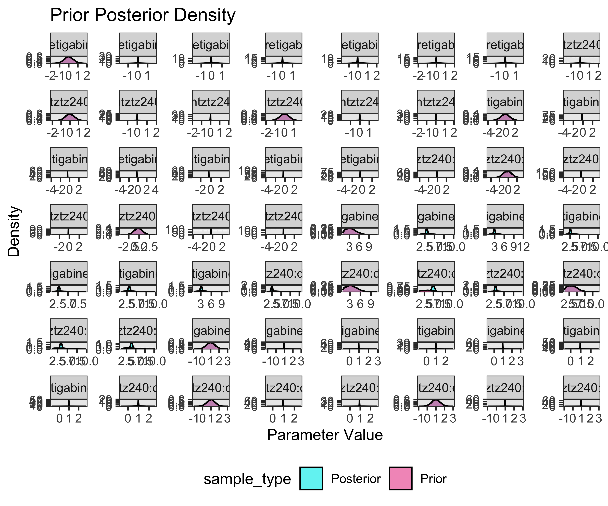
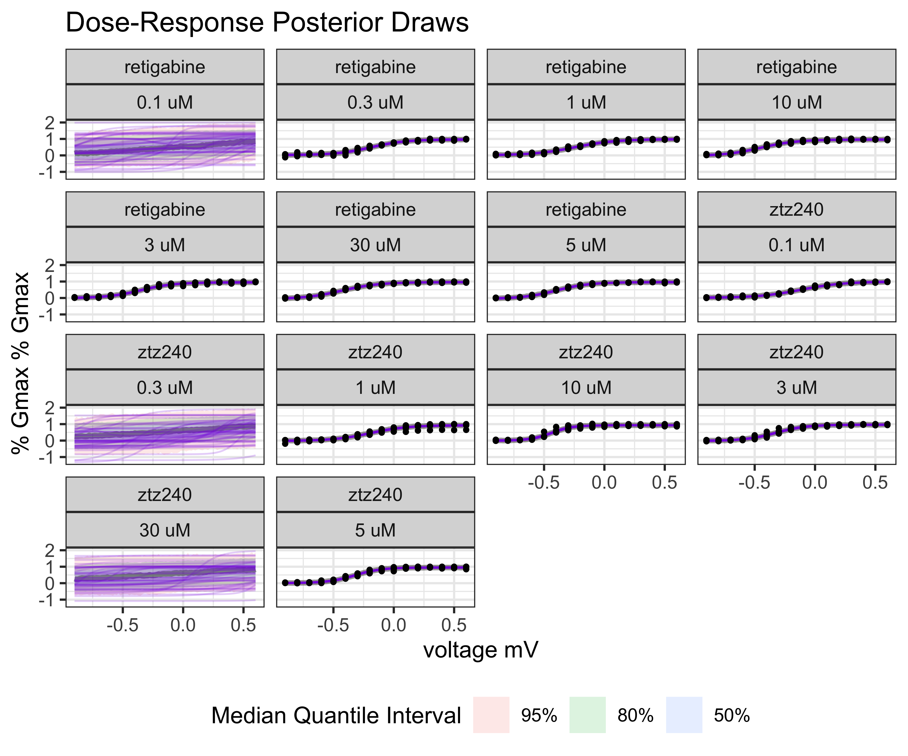
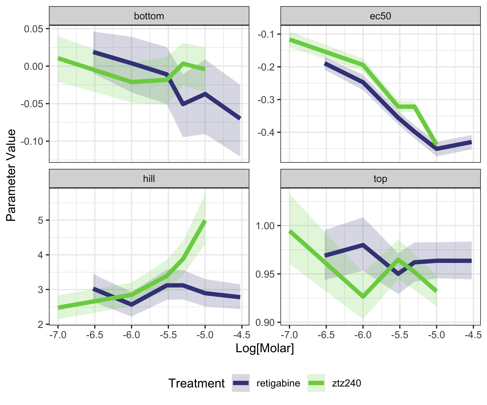

```r
read_range <- function(
    sheet,
    range,
    treatment,
    dose_uM,
    is_control){
  readxl::read_excel(
    path = here::here(
      "inst", "extdata", "conductance_KCNQ", "Li_CellRes_2021_fig1.xlsx"),
    sheet = {{sheet}},
    range = range,
    col_names = FALSE,
    .name_repair = ~ paste0("replica_", 1:length(.))) |>
    dplyr::mutate(
      treatment = {{treatment}},
      dose_uM = {{dose_uM}},
      is_control = {{is_control}},
      voltage = seq(-90, 60, by = 10),
      .before = 1) |>
    tidyr::pivot_longer(
      cols = c(-treatment, -dose_uM, -is_control, -voltage),
      names_to = "replica",
      values_to = "conductance")
}

data <- dplyr::bind_rows(
  read_range(
    sheet = "fig1b", range = "E3:I18",
    treatment = "ztz240", dose_uM = 10, is_control = TRUE),
  read_range(
    sheet = "fig1b", range = "L3:P18",
    treatment = "ztz240", dose_uM = 10, is_control = FALSE),
  read_range(
    sheet = "fig1b", range = "E22:I37",
    treatment = "ztz240", dose_uM = 5, is_control = TRUE),
  read_range(
    sheet = "fig1b", range = "L22:P37",
    treatment = "ztz240", dose_uM = 5, is_control = FALSE),  
  read_range(
    sheet = "fig1b", range = "E40:I55",
    treatment = "ztz240", dose_uM = 3, is_control = TRUE),
  read_range(
    sheet = "fig1b", range = "L40:P55",
    treatment = "ztz240", dose_uM = 3, is_control = FALSE), 
  read_range(
    sheet = "fig1b", range = "E58:J73",
    treatment = "ztz240", dose_uM = 1, is_control = TRUE),
  read_range(
    sheet = "fig1b", range = "L58:Q73",
    treatment = "ztz240", dose_uM = 1, is_control = FALSE),   
  read_range(
    sheet = "fig1b", range = "E77:I92",
    treatment = "ztz240", dose_uM = 0.1, is_control = TRUE),
  read_range(
    sheet = "fig1b", range = "L77:P92",
    treatment = "ztz240", dose_uM = 0.1, is_control = FALSE),

  read_range(
    sheet = "fig 1d", range = "D2:I17",
    treatment = "retigabine", dose_uM = 30, is_control = TRUE),
  read_range(
    sheet = "fig 1d", range = "M2:R17",
    treatment = "retigabine", dose_uM = 30, is_control = FALSE),
  read_range(
    sheet = "fig 1d", range = "D20:I35",
    treatment = "retigabine", dose_uM = 10, is_control = TRUE),
  read_range(
    sheet = "fig 1d", range = "M20:R35",
    treatment = "retigabine", dose_uM = 10, is_control = FALSE),  
  read_range(
    sheet = "fig 1d", range = "D39:H54",
    treatment = "retigabine", dose_uM = 5, is_control = TRUE),
  read_range(
    sheet = "fig 1d", range = "M39:Q54",
    treatment = "retigabine", dose_uM = 5, is_control = FALSE), 
  read_range(
    sheet = "fig 1d", range = "D57:H72",
    treatment = "retigabine", dose_uM = 3, is_control = TRUE),
  read_range(
    sheet = "fig 1d", range = "M57:Q72",
    treatment = "retigabine", dose_uM = 3, is_control = FALSE),   
  read_range(
    sheet = "fig 1d", range = "D76:H91",
    treatment = "retigabine", dose_uM = 1, is_control = TRUE),
  read_range(
    sheet = "fig 1d", range = "M76:Q91",
    treatment = "retigabine", dose_uM = 1, is_control = FALSE),
  read_range(
    sheet = "fig 1d", range = "D95:H110",
    treatment = "retigabine", dose_uM = 0.3, is_control = TRUE),
  read_range(
    sheet = "fig 1d", range = "M95:Q110",
    treatment = "retigabine", dose_uM = 0.3, is_control = FALSE))
```


```
## Coordinate system already present. Adding new coordinate system, which will
## replace the existing one.
```

```
## Error in check_breaks_labels(breaks, labels): object 'd2_label' not found
```


```r
model_conductance <- BayesPharma::sigmoid_model(
  data = model_data,
  formula = BayesPharma::sigmoid_agonist_formula(
    treatment_variable = "voltage",
    treatment_units = "mV",
    response_variable = "conductance",
    response_units = "% Gmax",
    predictors = 0 + treatment:doselabel),
  prior = BayesPharma::sigmoid_agonist_prior(
    ec50 = brms::prior(normal(-0.2, 1), nlpar = "ec50"),
    hill = brms::prior(normal(3, 2), nlpar = "hill", lb = 1)),
  cores = 4)
```


```r
model_conductance |>
  BayesPharma::plot_prior_posterior_densities()
```

```
## 
## SAMPLING FOR MODEL 'anon_model' NOW (CHAIN 1).
## Chain 1: 
## Chain 1: Gradient evaluation took 1.4e-05 seconds
## Chain 1: 1000 transitions using 10 leapfrog steps per transition would take 0.14 seconds.
## Chain 1: Adjust your expectations accordingly!
## Chain 1: 
## Chain 1: 
## Chain 1: Iteration:    1 / 2000 [  0%]  (Warmup)
## Chain 1: Iteration:  200 / 2000 [ 10%]  (Warmup)
## Chain 1: Iteration:  400 / 2000 [ 20%]  (Warmup)
## Chain 1: Iteration:  600 / 2000 [ 30%]  (Warmup)
## Chain 1: Iteration:  800 / 2000 [ 40%]  (Warmup)
## Chain 1: Iteration: 1000 / 2000 [ 50%]  (Warmup)
## Chain 1: Iteration: 1001 / 2000 [ 50%]  (Sampling)
## Chain 1: Iteration: 1200 / 2000 [ 60%]  (Sampling)
## Chain 1: Iteration: 1400 / 2000 [ 70%]  (Sampling)
## Chain 1: Iteration: 1600 / 2000 [ 80%]  (Sampling)
## Chain 1: Iteration: 1800 / 2000 [ 90%]  (Sampling)
## Chain 1: Iteration: 2000 / 2000 [100%]  (Sampling)
## Chain 1: 
## Chain 1:  Elapsed Time: 0.146 seconds (Warm-up)
## Chain 1:                0.171 seconds (Sampling)
## Chain 1:                0.317 seconds (Total)
## Chain 1: 
## 
## SAMPLING FOR MODEL 'anon_model' NOW (CHAIN 2).
## Chain 2: 
## Chain 2: Gradient evaluation took 4e-06 seconds
## Chain 2: 1000 transitions using 10 leapfrog steps per transition would take 0.04 seconds.
## Chain 2: Adjust your expectations accordingly!
## Chain 2: 
## Chain 2: 
## Chain 2: Iteration:    1 / 2000 [  0%]  (Warmup)
## Chain 2: Iteration:  200 / 2000 [ 10%]  (Warmup)
## Chain 2: Iteration:  400 / 2000 [ 20%]  (Warmup)
## Chain 2: Iteration:  600 / 2000 [ 30%]  (Warmup)
## Chain 2: Iteration:  800 / 2000 [ 40%]  (Warmup)
## Chain 2: Iteration: 1000 / 2000 [ 50%]  (Warmup)
## Chain 2: Iteration: 1001 / 2000 [ 50%]  (Sampling)
## Chain 2: Iteration: 1200 / 2000 [ 60%]  (Sampling)
## Chain 2: Iteration: 1400 / 2000 [ 70%]  (Sampling)
## Chain 2: Iteration: 1600 / 2000 [ 80%]  (Sampling)
## Chain 2: Iteration: 1800 / 2000 [ 90%]  (Sampling)
## Chain 2: Iteration: 2000 / 2000 [100%]  (Sampling)
## Chain 2: 
## Chain 2:  Elapsed Time: 0.146 seconds (Warm-up)
## Chain 2:                0.188 seconds (Sampling)
## Chain 2:                0.334 seconds (Total)
## Chain 2: 
## 
## SAMPLING FOR MODEL 'anon_model' NOW (CHAIN 3).
## Chain 3: 
## Chain 3: Gradient evaluation took 3e-06 seconds
## Chain 3: 1000 transitions using 10 leapfrog steps per transition would take 0.03 seconds.
## Chain 3: Adjust your expectations accordingly!
## Chain 3: 
## Chain 3: 
## Chain 3: Iteration:    1 / 2000 [  0%]  (Warmup)
## Chain 3: Iteration:  200 / 2000 [ 10%]  (Warmup)
## Chain 3: Iteration:  400 / 2000 [ 20%]  (Warmup)
## Chain 3: Iteration:  600 / 2000 [ 30%]  (Warmup)
## Chain 3: Iteration:  800 / 2000 [ 40%]  (Warmup)
## Chain 3: Iteration: 1000 / 2000 [ 50%]  (Warmup)
## Chain 3: Iteration: 1001 / 2000 [ 50%]  (Sampling)
## Chain 3: Iteration: 1200 / 2000 [ 60%]  (Sampling)
## Chain 3: Iteration: 1400 / 2000 [ 70%]  (Sampling)
## Chain 3: Iteration: 1600 / 2000 [ 80%]  (Sampling)
## Chain 3: Iteration: 1800 / 2000 [ 90%]  (Sampling)
## Chain 3: Iteration: 2000 / 2000 [100%]  (Sampling)
## Chain 3: 
## Chain 3:  Elapsed Time: 0.157 seconds (Warm-up)
## Chain 3:                0.113 seconds (Sampling)
## Chain 3:                0.27 seconds (Total)
## Chain 3: 
## 
## SAMPLING FOR MODEL 'anon_model' NOW (CHAIN 4).
## Chain 4: 
## Chain 4: Gradient evaluation took 5e-06 seconds
## Chain 4: 1000 transitions using 10 leapfrog steps per transition would take 0.05 seconds.
## Chain 4: Adjust your expectations accordingly!
## Chain 4: 
## Chain 4: 
## Chain 4: Iteration:    1 / 2000 [  0%]  (Warmup)
## Chain 4: Iteration:  200 / 2000 [ 10%]  (Warmup)
## Chain 4: Iteration:  400 / 2000 [ 20%]  (Warmup)
## Chain 4: Iteration:  600 / 2000 [ 30%]  (Warmup)
## Chain 4: Iteration:  800 / 2000 [ 40%]  (Warmup)
## Chain 4: Iteration: 1000 / 2000 [ 50%]  (Warmup)
## Chain 4: Iteration: 1001 / 2000 [ 50%]  (Sampling)
## Chain 4: Iteration: 1200 / 2000 [ 60%]  (Sampling)
## Chain 4: Iteration: 1400 / 2000 [ 70%]  (Sampling)
## Chain 4: Iteration: 1600 / 2000 [ 80%]  (Sampling)
## Chain 4: Iteration: 1800 / 2000 [ 90%]  (Sampling)
## Chain 4: Iteration: 2000 / 2000 [100%]  (Sampling)
## Chain 4: 
## Chain 4:  Elapsed Time: 0.158 seconds (Warm-up)
## Chain 4:                0.187 seconds (Sampling)
## Chain 4:                0.345 seconds (Total)
## Chain 4:
```




```r
model_conductance |>
  BayesPharma::plot_posterior_draws()
```


Fit MuSyC Model


```
## Warning in BayesPharma::MuSyC_model(data = model_data, formula = BayesPharma::MuSyC_formula(treatment_1_variable = "voltage", : There needs to be variable for treatment 2 'log_dose' as a column in the input 'data' data.frame
```

```
## Error in `dplyr::mutate()`:
## ℹ In argument: `logd2scale = mean(.data[["log_dose"]])`.
## Caused by error in `.data[["log_dose"]]`:
## ! Column `log_dose` not found in `.data`.
```

```
## Error in stanc(file = file, model_code = model_code, model_name = model_name, : 0
## 
## Semantic error in 'string', line 84, column 24 to column 27:
## 
## Identifier 'Inf' not in scope.
```

Join the conductance model with the dose information to model how the voltage
dependence depends on the drug dose

```
## # A tibble: 44 × 15
##    variable_type variable predictors_label         mean   median      sd     mad
##    <chr>         <chr>    <chr>                   <dbl>    <dbl>   <dbl>   <dbl>
##  1 b             ec50     treatmentztz240:dos… -0.116   -0.116   0.0148  0.0148 
##  2 b             ec50     treatmentretigabine… -0.189   -0.189   0.0120  0.0120 
##  3 b             ec50     treatmentretigabine… -0.247   -0.247   0.0142  0.0141 
##  4 b             ec50     treatmentztz240:dos… -0.194   -0.194   0.0116  0.0117 
##  5 b             ec50     treatmentretigabine… -0.451   -0.450   0.0137  0.0136 
##  6 b             ec50     treatmentztz240:dos… -0.438   -0.438   0.00831 0.00820
##  7 b             ec50     treatmentretigabine… -0.356   -0.356   0.0126  0.0126 
##  8 b             ec50     treatmentztz240:dos… -0.322   -0.322   0.0106  0.0106 
##  9 b             ec50     treatmentretigabine… -0.430   -0.430   0.0134  0.0132 
## 10 b             ec50     treatmentretigabine… -0.398   -0.398   0.0125  0.0123 
## 11 b             ec50     treatmentztz240:dos… -0.322   -0.322   0.00976 0.00974
## 12 b             hill     treatmentztz240:dos…  2.48     2.47    0.210   0.206  
## 13 b             hill     treatmentretigabine…  3.03     3.02    0.244   0.244  
## 14 b             hill     treatmentretigabine…  2.57     2.56    0.216   0.211  
## 15 b             hill     treatmentztz240:dos…  2.85     2.84    0.209   0.207  
## 16 b             hill     treatmentretigabine…  2.89     2.89    0.238   0.236  
## 17 b             hill     treatmentztz240:dos…  4.99     4.97    0.436   0.437  
## 18 b             hill     treatmentretigabine…  3.12     3.11    0.266   0.262  
## 19 b             hill     treatmentztz240:dos…  3.39     3.38    0.270   0.271  
## 20 b             hill     treatmentretigabine…  2.78     2.77    0.217   0.215  
## 21 b             hill     treatmentretigabine…  3.12     3.11    0.257   0.252  
## 22 b             hill     treatmentztz240:dos…  3.88     3.86    0.297   0.296  
## 23 b             top      treatmentztz240:dos…  0.995    0.994   0.0220  0.0216 
## 24 b             top      treatmentretigabine…  0.969    0.969   0.0157  0.0157 
## 25 b             top      treatmentretigabine…  0.980    0.979   0.0168  0.0165 
## 26 b             top      treatmentztz240:dos…  0.927    0.926   0.0147  0.0147 
## 27 b             top      treatmentretigabine…  0.964    0.963   0.0113  0.0111 
## 28 b             top      treatmentztz240:dos…  0.932    0.932   0.00974 0.00978
## 29 b             top      treatmentretigabine…  0.950    0.950   0.0128  0.0127 
## 30 b             top      treatmentztz240:dos…  0.965    0.965   0.0125  0.0125 
## 31 b             top      treatmentretigabine…  0.964    0.963   0.0119  0.0119 
## 32 b             top      treatmentretigabine…  0.962    0.962   0.0124  0.0124 
## 33 b             top      treatmentztz240:dos…  0.952    0.952   0.0115  0.0114 
## 34 b             bottom   treatmentztz240:dos…  0.0106   0.0113  0.0185  0.0183 
## 35 b             bottom   treatmentretigabine…  0.0189   0.0192  0.0170  0.0168 
## 36 b             bottom   treatmentretigabine…  0.00381  0.00483 0.0226  0.0222 
## 37 b             bottom   treatmentztz240:dos… -0.0212  -0.0208  0.0163  0.0161 
## 38 b             bottom   treatmentretigabine… -0.0372  -0.0353  0.0304  0.0297 
## 39 b             bottom   treatmentztz240:dos… -0.00422 -0.00393 0.0184  0.0183 
## 40 b             bottom   treatmentretigabine… -0.0109  -0.00978 0.0231  0.0229 
## 41 b             bottom   treatmentztz240:dos… -0.0184  -0.0175  0.0196  0.0195 
## 42 b             bottom   treatmentretigabine… -0.0701  -0.0684  0.0291  0.0285 
## 43 b             bottom   treatmentretigabine… -0.0506  -0.0495  0.0258  0.0251 
## 44 b             bottom   treatmentztz240:dos…  0.00329  0.00375 0.0171  0.0171 
## # ℹ 8 more variables: q5 <dbl>, q95 <dbl>, rhat <dbl>, ess_bulk <dbl>,
## #   ess_tail <dbl>, treatment <chr>, logdose <dbl>, doselabel <fct>
```





```
##  Family: gaussian 
##   Links: mu = identity; sigma = identity 
## Formula: conductance ~ sigmoid(sigmoid(Eec50, Ehill, Etop, Ebottom, logdose), sigmoid(Hec50, Hhill, Htop, Hbottom, logdose), vtop, vbottom, voltage) 
##          vtop ~ 1
##          vbottom ~ 1
##          Eec50 ~ 0 + treatment
##          Ehill ~ 0 + treatment
##          Etop ~ 0 + treatment
##          Ebottom ~ 0 + treatment
##          Hec50 ~ 0 + treatment
##          Hhill ~ 0 + treatment
##          Htop ~ 0 + treatment
##          Hbottom ~ 0 + treatment
##    Data: model_data (Number of observations: 928) 
##   Draws: 4 chains, each with iter = 2000; warmup = 1000; thin = 1;
##          total post-warmup draws = 4000
## 
## Population-Level Effects: 
##                             Estimate Est.Error l-95% CI u-95% CI Rhat Bulk_ESS
## vtop_Intercept                  0.95      0.00     0.95     0.96 1.00     4518
## vbottom_Intercept              -0.00      0.01    -0.01     0.01 1.00     4412
## Eec50_treatmentretigabine      -5.77      0.07    -5.92    -5.64 1.00     2270
## Eec50_treatmentztz240          -5.46      0.06    -5.56    -5.34 1.00     1927
## Ehill_treatmentretigabine      -1.62      0.27    -2.16    -1.10 1.00     1665
## Ehill_treatmentztz240          -1.46      0.18    -1.83    -1.14 1.00     1521
## Etop_treatmentretigabine       -0.19      0.02    -0.22    -0.15 1.00     1775
## Etop_treatmentztz240           -0.14      0.01    -0.15    -0.12 1.00     3807
## Ebottom_treatmentretigabine    -0.43      0.01    -0.44    -0.41 1.00     3188
## Ebottom_treatmentztz240        -0.48      0.03    -0.54    -0.44 1.00     1632
## Hec50_treatmentretigabine      -3.86      1.83    -7.99    -0.35 1.00     1144
## Hec50_treatmentztz240          -5.15      0.21    -5.52    -4.68 1.00     2063
## Hhill_treatmentretigabine       1.27      0.74     0.22     2.95 1.00     2766
## Hhill_treatmentztz240           1.79      0.50     1.03     2.91 1.00     2627
## Htop_treatmentretigabine        4.52      1.63     2.35     8.23 1.00     2457
## Htop_treatmentztz240            5.81      1.15     4.29     8.76 1.00     2196
## Hbottom_treatmentretigabine     3.00      0.09     2.82     3.15 1.00     2573
## Hbottom_treatmentztz240         2.84      0.08     2.68     2.99 1.00     3918
##                             Tail_ESS
## vtop_Intercept                  3007
## vbottom_Intercept               2945
## Eec50_treatmentretigabine       1466
## Eec50_treatmentztz240           1847
## Ehill_treatmentretigabine       1246
## Ehill_treatmentztz240           2227
## Etop_treatmentretigabine        1330
## Etop_treatmentztz240            3066
## Ebottom_treatmentretigabine     2429
## Ebottom_treatmentztz240         1444
## Hec50_treatmentretigabine       1629
## Hec50_treatmentztz240           2300
## Hhill_treatmentretigabine       2312
## Hhill_treatmentztz240           3078
## Htop_treatmentretigabine        2565
## Htop_treatmentztz240            2221
## Hbottom_treatmentretigabine     2994
## Hbottom_treatmentztz240         2764
## 
## Family Specific Parameters: 
##       Estimate Est.Error l-95% CI u-95% CI Rhat Bulk_ESS Tail_ESS
## sigma     0.06      0.00     0.06     0.06 1.00     3906     2490
## 
## Draws were sampled using sampling(NUTS). For each parameter, Bulk_ESS
## and Tail_ESS are effective sample size measures, and Rhat is the potential
## scale reduction factor on split chains (at convergence, Rhat = 1).
```


```
## Error in brms::loo_compare(model_MuSyC, model_bilevel): object 'model_MuSyC' not found
```

