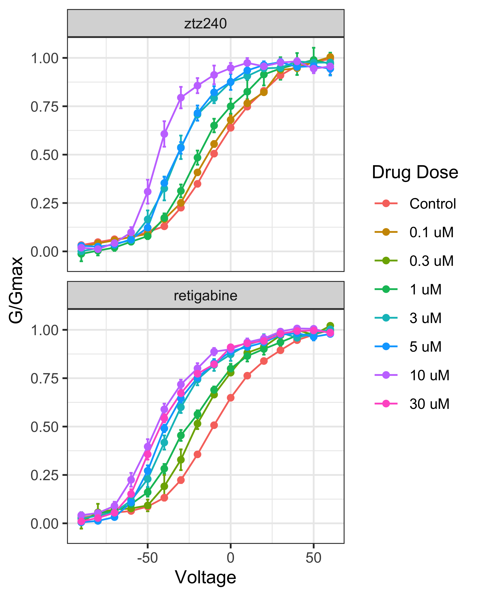

<style type="text/css">

code.r{
  font-size: 9px;
}
pre {
  font-size: 9px
}
</style>


# Re-analysis Figure 1 of (Li, et al., 2021) Molecular Basis for Ligand Activation of the Human KCNQ2 Channel

KCNQ2 is a voltage gated potassium channel important for re-establishing neuronal homeostasis following an action potential. Dis-regulation of channels in the KCNQ family can cause epilepsy, tinnitus, and depression. While there has been sustained interest in developing small-molecule based therapeutics targeting KCNQ2, the only FDA approved drug that targets KCNQ2, retigabine, was given a black-box warning due to unwanted side-effects, even though it was effective at treating epilepsy. Excitingly there has been recent progress in using Cryo-EM to structurally characterize ion channels including KCNQ2, which promise to support structure-based drug design.

Recently, [@Li2021-ef] used Cryo-EM to characterize the structure of KCNQ2 in complex with retigabine, which interacts in the membrane on the outside of the pore, and ztz240, which interacts with the voltage sensor domain. To relate the structure and function, [@Li2021-ef] measured conductance as a function of voltage (G-V curves) in the presence of varying doses of retigabine and ztz240 using whole cell patch-clamp electrophysiology in Chinese hamster ovary (CHO)-K1 cells overexpressing KCNQ2. Both compounds are thought to be agonists, that is with increasing concentration of drug, less negative voltages are required to open the channel.

In this case study, the aim is to re-analyze the effects of retigabine and ztz240 using the data collected in [@Li2021-ef] and presented in panels B and D of figure 1. A key idea is to recognize that voltage and drug treatment can be thought of independent perturbations and the drug effect can be framed as characterizing the interaction between these perturbations.

To begin, we will load and plot the data,


```
## # A tibble: 1,856 × 6
##    treatment dose_uM is_control voltage replica   conductance
##    <chr>       <dbl> <lgl>        <dbl> <chr>           <dbl>
##  1 ztz240         10 TRUE           -90 replica_1      0.0403
##  2 ztz240         10 TRUE           -90 replica_2      0.0632
##  3 ztz240         10 TRUE           -90 replica_3      0.0200
##  4 ztz240         10 TRUE           -90 replica_4      0.0404
##  5 ztz240         10 TRUE           -90 replica_5      0.0175
##  6 ztz240         10 TRUE           -80 replica_1      0.0469
##  7 ztz240         10 TRUE           -80 replica_2      0.0682
##  8 ztz240         10 TRUE           -80 replica_3      0.0345
##  9 ztz240         10 TRUE           -80 replica_4      0.0574
## 10 ztz240         10 TRUE           -80 replica_5      0.0339
## # ℹ 1,846 more rows
```
\normalsize

<div class="figure" style="text-align: center">

<p class="caption">Reproduction of Figure 1b and 1d from (Li, et al., 2021)</p>
</div>
Then, for each treatment and dose, we will fit a sigmoid curve, which has an comparable functional form to the what they call the Boltzmann equation for G/Gmax as a function of voltage. To make the fitting more stable, we will transform the treatment and response scales.


```r
model_conductance <- BayesPharma::sigmoid_model(
  data = model_data,
  formula = BayesPharma::sigmoid_agonist_formula(
    treatment_variable = "voltage",
    treatment_units = "mV",
    response_variable = "conductance",
    response_units = "% Gmax",
    predictors = 0 + treatment:doselabel),
  prior = BayesPharma::sigmoid_agonist_prior(
    ec50 = brms::prior(normal(-0.2, 1), nlpar = "ec50"),
    hill = brms::prior(normal(3, 2), nlpar = "hill", lb = 0)),
  init = BayesPharma::sigmoid_agonist_init(
    ec50 = \() runif(1, min = -7, max = -5),
    hill = \() runif(1, min = 0.8, max = 1.2),
    bottom = \() runif(1, min = -.1, max = 0.1),
    top = \() runif(1, min = 0.8, max = 1.2)),
  cores = 4)
```

```
##  Family: gaussian 
##   Links: mu = identity; sigma = identity 
## Formula: conductance ~ sigmoid(ec50, hill, top, bottom, voltage) 
##          ec50 ~ 0 + treatment:doselabel
##          hill ~ 0 + treatment:doselabel
##          top ~ 0 + treatment:doselabel
##          bottom ~ 0 + treatment:doselabel
##    Data: data (Number of observations: 928) 
##   Draws: 4 chains, each with iter = 8000; warmup = 4000; thin = 1;
##          total post-warmup draws = 16000
## 
## Population-Level Effects: 
##                                           Estimate Est.Error l-95% CI u-95% CI
## ec50_treatmentretigabine:doselabel0.1uM      -0.21      0.99    -2.16     1.74
## ec50_treatmentztz240:doselabel0.1uM          -0.12      0.01    -0.14    -0.09
## ec50_treatmentretigabine:doselabel0.3uM      -0.19      0.01    -0.21    -0.17
## ec50_treatmentztz240:doselabel0.3uM          -0.19      1.00    -2.13     1.76
## ec50_treatmentretigabine:doselabel1uM        -0.25      0.01    -0.28    -0.22
## ec50_treatmentztz240:doselabel1uM            -0.19      0.01    -0.22    -0.17
## ec50_treatmentretigabine:doselabel10uM       -0.45      0.01    -0.48    -0.43
## ec50_treatmentztz240:doselabel10uM           -0.44      0.01    -0.45    -0.42
## ec50_treatmentretigabine:doselabel3uM        -0.36      0.01    -0.38    -0.33
## ec50_treatmentztz240:doselabel3uM            -0.32      0.01    -0.34    -0.30
## ec50_treatmentretigabine:doselabel30uM       -0.43      0.01    -0.46    -0.40
## ec50_treatmentztz240:doselabel30uM           -0.21      0.99    -2.14     1.73
## ec50_treatmentretigabine:doselabel5uM        -0.40      0.01    -0.42    -0.37
## ec50_treatmentztz240:doselabel5uM            -0.32      0.01    -0.34    -0.30
## hill_treatmentretigabine:doselabel0.1uM       3.29      1.76     0.34     7.02
## hill_treatmentztz240:doselabel0.1uM           2.48      0.21     2.09     2.91
## hill_treatmentretigabine:doselabel0.3uM       3.02      0.25     2.57     3.54
## hill_treatmentztz240:doselabel0.3uM           3.27      1.78     0.31     7.06
## hill_treatmentretigabine:doselabel1uM         2.57      0.21     2.17     3.00
## hill_treatmentztz240:doselabel1uM             2.85      0.21     2.46     3.28
## hill_treatmentretigabine:doselabel10uM        2.89      0.24     2.45     3.37
## hill_treatmentztz240:doselabel10uM            4.99      0.44     4.20     5.93
## hill_treatmentretigabine:doselabel3uM         3.11      0.27     2.63     3.67
## hill_treatmentztz240:doselabel3uM             3.39      0.27     2.88     3.96
## hill_treatmentretigabine:doselabel30uM        2.78      0.22     2.37     3.23
## hill_treatmentztz240:doselabel30uM            3.28      1.74     0.34     6.95
## hill_treatmentretigabine:doselabel5uM         3.12      0.25     2.64     3.64
## hill_treatmentztz240:doselabel5uM             3.88      0.29     3.34     4.50
## top_treatmentretigabine:doselabel0.1uM        1.00      0.50    -0.01     1.97
## top_treatmentztz240:doselabel0.1uM            0.99      0.02     0.95     1.04
## top_treatmentretigabine:doselabel0.3uM        0.97      0.02     0.94     1.00
## top_treatmentztz240:doselabel0.3uM            1.00      0.51     0.00     2.01
## top_treatmentretigabine:doselabel1uM          0.98      0.02     0.95     1.01
## top_treatmentztz240:doselabel1uM              0.93      0.01     0.90     0.96
## top_treatmentretigabine:doselabel10uM         0.96      0.01     0.94     0.99
## top_treatmentztz240:doselabel10uM             0.93      0.01     0.91     0.95
## top_treatmentretigabine:doselabel3uM          0.95      0.01     0.93     0.98
## top_treatmentztz240:doselabel3uM              0.96      0.01     0.94     0.99
## top_treatmentretigabine:doselabel30uM         0.96      0.01     0.94     0.99
## top_treatmentztz240:doselabel30uM             1.00      0.51     0.00     2.00
## top_treatmentretigabine:doselabel5uM          0.96      0.01     0.94     0.99
## top_treatmentztz240:doselabel5uM              0.95      0.01     0.93     0.98
## bottom_treatmentretigabine:doselabel0.1uM    -0.00      0.50    -0.99     1.00
## bottom_treatmentztz240:doselabel0.1uM         0.01      0.02    -0.03     0.05
## bottom_treatmentretigabine:doselabel0.3uM     0.02      0.02    -0.02     0.05
## bottom_treatmentztz240:doselabel0.3uM        -0.00      0.50    -0.98     0.97
## bottom_treatmentretigabine:doselabel1uM       0.00      0.02    -0.04     0.04
## bottom_treatmentztz240:doselabel1uM          -0.02      0.02    -0.06     0.01
## bottom_treatmentretigabine:doselabel10uM     -0.04      0.03    -0.10     0.02
## bottom_treatmentztz240:doselabel10uM         -0.00      0.02    -0.04     0.03
## bottom_treatmentretigabine:doselabel3uM      -0.01      0.02    -0.06     0.03
## bottom_treatmentztz240:doselabel3uM          -0.02      0.02    -0.06     0.02
## bottom_treatmentretigabine:doselabel30uM     -0.07      0.03    -0.13    -0.02
## bottom_treatmentztz240:doselabel30uM          0.00      0.51    -0.98     0.99
## bottom_treatmentretigabine:doselabel5uM      -0.05      0.03    -0.10    -0.00
## bottom_treatmentztz240:doselabel5uM           0.00      0.02    -0.03     0.04
##                                           Rhat Bulk_ESS Tail_ESS
## ec50_treatmentretigabine:doselabel0.1uM   1.00    30391    11436
## ec50_treatmentztz240:doselabel0.1uM       1.00    20374    12095
## ec50_treatmentretigabine:doselabel0.3uM   1.00    20548    12368
## ec50_treatmentztz240:doselabel0.3uM       1.00    30562    11078
## ec50_treatmentretigabine:doselabel1uM     1.00    19529    12866
## ec50_treatmentztz240:doselabel1uM         1.00    18726    11783
## ec50_treatmentretigabine:doselabel10uM    1.00    14923    11194
## ec50_treatmentztz240:doselabel10uM        1.00    19044    12709
## ec50_treatmentretigabine:doselabel3uM     1.00    19893    12650
## ec50_treatmentztz240:doselabel3uM         1.00    18533    12575
## ec50_treatmentretigabine:doselabel30uM    1.00    15556    11467
## ec50_treatmentztz240:doselabel30uM        1.00    32094    12295
## ec50_treatmentretigabine:doselabel5uM     1.00    16017    11630
## ec50_treatmentztz240:doselabel5uM         1.00    19357    12504
## hill_treatmentretigabine:doselabel0.1uM   1.00    11901     6023
## hill_treatmentztz240:doselabel0.1uM       1.00    13038    11273
## hill_treatmentretigabine:doselabel0.3uM   1.00    13990    11889
## hill_treatmentztz240:doselabel0.3uM       1.00    10958     5961
## hill_treatmentretigabine:doselabel1uM     1.00    13862    11493
## hill_treatmentztz240:doselabel1uM         1.00    14460    12552
## hill_treatmentretigabine:doselabel10uM    1.00    12166    10898
## hill_treatmentztz240:doselabel10uM        1.00    17855    12689
## hill_treatmentretigabine:doselabel3uM     1.00    13874    11471
## hill_treatmentztz240:doselabel3uM         1.00    15542    12281
## hill_treatmentretigabine:doselabel30uM    1.00    12468    10799
## hill_treatmentztz240:doselabel30uM        1.00    11153     5701
## hill_treatmentretigabine:doselabel5uM     1.00    14008    10974
## hill_treatmentztz240:doselabel5uM         1.00    18037    13691
## top_treatmentretigabine:doselabel0.1uM    1.00    29269    10972
## top_treatmentztz240:doselabel0.1uM        1.00    13585    10941
## top_treatmentretigabine:doselabel0.3uM    1.00    15611    12140
## top_treatmentztz240:doselabel0.3uM        1.00    31344    11397
## top_treatmentretigabine:doselabel1uM      1.00    16947    12046
## top_treatmentztz240:doselabel1uM          1.00    15880    11971
## top_treatmentretigabine:doselabel10uM     1.00    18849    12348
## top_treatmentztz240:doselabel10uM         1.00    22645    13130
## top_treatmentretigabine:doselabel3uM      1.00    18227    11925
## top_treatmentztz240:doselabel3uM          1.00    19419    12914
## top_treatmentretigabine:doselabel30uM     1.00    18399    12911
## top_treatmentztz240:doselabel30uM         1.00    32006    11651
## top_treatmentretigabine:doselabel5uM      1.00    20547    12750
## top_treatmentztz240:doselabel5uM          1.00    21502    12343
## bottom_treatmentretigabine:doselabel0.1uM 1.00    30476    10916
## bottom_treatmentztz240:doselabel0.1uM     1.00    15599    11659
## bottom_treatmentretigabine:doselabel0.3uM 1.00    15979    11851
## bottom_treatmentztz240:doselabel0.3uM     1.00    28315    11477
## bottom_treatmentretigabine:doselabel1uM   1.00    14083    12040
## bottom_treatmentztz240:doselabel1uM       1.00    15537    12230
## bottom_treatmentretigabine:doselabel10uM  1.00    11420     9609
## bottom_treatmentztz240:doselabel10uM      1.00    16765    12710
## bottom_treatmentretigabine:doselabel3uM   1.00    13924     9992
## bottom_treatmentztz240:doselabel3uM       1.00    15230    11342
## bottom_treatmentretigabine:doselabel30uM  1.00    12530     9593
## bottom_treatmentztz240:doselabel30uM      1.00    31204    11866
## bottom_treatmentretigabine:doselabel5uM   1.00    12771     9741
## bottom_treatmentztz240:doselabel5uM       1.00    16585    12256
## 
## Family Specific Parameters: 
##       Estimate Est.Error l-95% CI u-95% CI Rhat Bulk_ESS Tail_ESS
## sigma     0.06      0.00     0.06     0.06 1.00    26064    12204
## 
## Draws were sampled using sampling(NUTS). For each parameter, Bulk_ESS
## and Tail_ESS are effective sample size measures, and Rhat is the potential
## scale reduction factor on split chains (at convergence, Rhat = 1).
```


```r
model_conductance |>
  BayesPharma::plot_prior_posterior_densities(refresh = 0)
```

<div class="figure" style="text-align: center">

<p class="caption">plot of chunk model-conductance-prior-posterior</p>
</div>


```r
model_conductance |>
  BayesPharma::plot_posterior_draws()
```

<div class="figure" style="text-align: center">

<p class="caption">plot of chunk model-conductance-predictive</p>
</div>
Fit MuSyC Model


```
## Running /Library/Frameworks/R.framework/Resources/bin/R CMD SHLIB foo.c
## clang -mmacosx-version-min=10.13 -I"/Library/Frameworks/R.framework/Resources/include" -DNDEBUG   -I"/Library/Frameworks/R.framework/Versions/4.2/Resources/library/Rcpp/include/"  -I"/Library/Frameworks/R.framework/Versions/4.2/Resources/miworkspace-library/RcppEigen/include/"  -I"/Library/Frameworks/R.framework/Versions/4.2/Resources/miworkspace-library/RcppEigen/include/unsupported"  -I"/Library/Frameworks/R.framework/Versions/4.2/Resources/miworkspace-library/BH/include" -I"/Library/Frameworks/R.framework/Versions/4.2/Resources/library/StanHeaders/include/src/"  -I"/Library/Frameworks/R.framework/Versions/4.2/Resources/library/StanHeaders/include/"  -I"/Library/Frameworks/R.framework/Versions/4.2/Resources/library/RcppParallel/include/"  -I"/Library/Frameworks/R.framework/Versions/4.2/Resources/library/rstan/include" -DEIGEN_NO_DEBUG  -DBOOST_DISABLE_ASSERTS  -DBOOST_PENDING_INTEGER_LOG2_HPP  -DSTAN_THREADS  -DUSE_STANC3 -DSTRICT_R_HEADERS  -DBOOST_PHOENIX_NO_VARIADIC_EXPRESSION  -D_HAS_AUTO_PTR_ETC=0  -include '/Library/Frameworks/R.framework/Versions/4.2/Resources/library/StanHeaders/include/stan/math/prim/fun/Eigen.hpp'  -D_REENTRANT -DRCPP_PARALLEL_USE_TBB=1   -I/usr/local/include   -fPIC  -Wall -g -O2  -c foo.c -o foo.o
## In file included from <built-in>:1:
## In file included from /Library/Frameworks/R.framework/Versions/4.2/Resources/library/StanHeaders/include/stan/math/prim/fun/Eigen.hpp:22:
## In file included from /Library/Frameworks/R.framework/Versions/4.2/Resources/miworkspace-library/RcppEigen/include/Eigen/Dense:1:
## In file included from /Library/Frameworks/R.framework/Versions/4.2/Resources/miworkspace-library/RcppEigen/include/Eigen/Core:88:
## /Library/Frameworks/R.framework/Versions/4.2/Resources/miworkspace-library/RcppEigen/include/Eigen/src/Core/util/Macros.h:628:1: error: unknown type name 'namespace'
## namespace Eigen {
## ^
## /Library/Frameworks/R.framework/Versions/4.2/Resources/miworkspace-library/RcppEigen/include/Eigen/src/Core/util/Macros.h:628:16: error: expected ';' after top level declarator
## namespace Eigen {
##                ^
##                ;
## In file included from <built-in>:1:
## In file included from /Library/Frameworks/R.framework/Versions/4.2/Resources/library/StanHeaders/include/stan/math/prim/fun/Eigen.hpp:22:
## In file included from /Library/Frameworks/R.framework/Versions/4.2/Resources/miworkspace-library/RcppEigen/include/Eigen/Dense:1:
## /Library/Frameworks/R.framework/Versions/4.2/Resources/miworkspace-library/RcppEigen/include/Eigen/Core:96:10: fatal error: 'complex' file not found
## #include <complex>
##          ^~~~~~~~~
## 3 errors generated.
## make[1]: *** [foo.o] Error 1
## Running /Library/Frameworks/R.framework/Resources/bin/R CMD SHLIB foo.c
## clang -mmacosx-version-min=10.13 -I"/Library/Frameworks/R.framework/Resources/include" -DNDEBUG   -I"/Library/Frameworks/R.framework/Versions/4.2/Resources/library/Rcpp/include/"  -I"/Library/Frameworks/R.framework/Versions/4.2/Resources/miworkspace-library/RcppEigen/include/"  -I"/Library/Frameworks/R.framework/Versions/4.2/Resources/miworkspace-library/RcppEigen/include/unsupported"  -I"/Library/Frameworks/R.framework/Versions/4.2/Resources/miworkspace-library/BH/include" -I"/Library/Frameworks/R.framework/Versions/4.2/Resources/library/StanHeaders/include/src/"  -I"/Library/Frameworks/R.framework/Versions/4.2/Resources/library/StanHeaders/include/"  -I"/Library/Frameworks/R.framework/Versions/4.2/Resources/library/RcppParallel/include/"  -I"/Library/Frameworks/R.framework/Versions/4.2/Resources/library/rstan/include" -DEIGEN_NO_DEBUG  -DBOOST_DISABLE_ASSERTS  -DBOOST_PENDING_INTEGER_LOG2_HPP  -DSTAN_THREADS  -DUSE_STANC3 -DSTRICT_R_HEADERS  -DBOOST_PHOENIX_NO_VARIADIC_EXPRESSION  -D_HAS_AUTO_PTR_ETC=0  -include '/Library/Frameworks/R.framework/Versions/4.2/Resources/library/StanHeaders/include/stan/math/prim/fun/Eigen.hpp'  -D_REENTRANT -DRCPP_PARALLEL_USE_TBB=1   -I/usr/local/include   -fPIC  -Wall -g -O2  -c foo.c -o foo.o
## In file included from <built-in>:1:
## In file included from /Library/Frameworks/R.framework/Versions/4.2/Resources/library/StanHeaders/include/stan/math/prim/fun/Eigen.hpp:22:
## In file included from /Library/Frameworks/R.framework/Versions/4.2/Resources/miworkspace-library/RcppEigen/include/Eigen/Dense:1:
## In file included from /Library/Frameworks/R.framework/Versions/4.2/Resources/miworkspace-library/RcppEigen/include/Eigen/Core:88:
## /Library/Frameworks/R.framework/Versions/4.2/Resources/miworkspace-library/RcppEigen/include/Eigen/src/Core/util/Macros.h:628:1: error: unknown type name 'namespace'
## namespace Eigen {
## ^
## /Library/Frameworks/R.framework/Versions/4.2/Resources/miworkspace-library/RcppEigen/include/Eigen/src/Core/util/Macros.h:628:16: error: expected ';' after top level declarator
## namespace Eigen {
##                ^
##                ;
## In file included from <built-in>:1:
## In file included from /Library/Frameworks/R.framework/Versions/4.2/Resources/library/StanHeaders/include/stan/math/prim/fun/Eigen.hpp:22:
## In file included from /Library/Frameworks/R.framework/Versions/4.2/Resources/miworkspace-library/RcppEigen/include/Eigen/Dense:1:
## /Library/Frameworks/R.framework/Versions/4.2/Resources/miworkspace-library/RcppEigen/include/Eigen/Core:96:10: fatal error: 'complex' file not found
## #include <complex>
##          ^~~~~~~~~
## 3 errors generated.
## make[1]: *** [foo.o] Error 1
```

Join the conductance model with the dose information to model how the voltage
dependence depends on the drug dose

```
## # A tibble: 44 × 15
##    variable_type variable predictors_label    mean median      sd     mad     q5
##    <chr>         <chr>    <chr>              <dbl>  <dbl>   <dbl>   <dbl>  <dbl>
##  1 b             ec50     treatmentztz240:… -0.116 -0.116 0.0146  0.0145  -0.140
##  2 b             ec50     treatmentretigab… -0.189 -0.189 0.0122  0.0121  -0.209
##  3 b             ec50     treatmentretigab… -0.247 -0.247 0.0143  0.0143  -0.271
##  4 b             ec50     treatmentztz240:… -0.194 -0.194 0.0117  0.0115  -0.214
##  5 b             ec50     treatmentretigab… -0.451 -0.451 0.0137  0.0133  -0.474
##  6 b             ec50     treatmentztz240:… -0.438 -0.438 0.00835 0.00834 -0.452
##  7 b             ec50     treatmentretigab… -0.356 -0.356 0.0124  0.0122  -0.377
##  8 b             ec50     treatmentztz240:… -0.322 -0.322 0.0109  0.0108  -0.340
##  9 b             ec50     treatmentretigab… -0.430 -0.429 0.0135  0.0132  -0.453
## 10 b             ec50     treatmentretigab… -0.398 -0.398 0.0123  0.0121  -0.419
## # ℹ 34 more rows
## # ℹ 7 more variables: q95 <dbl>, rhat <dbl>, ess_bulk <dbl>, ess_tail <dbl>,
## #   treatment <chr>, logdose <dbl>, doselabel <fct>
```


<div class="figure" style="text-align: center">

<p class="caption">plot of chunk plot-voltage-by-dose</p>
</div>


```
## Running /Library/Frameworks/R.framework/Resources/bin/R CMD SHLIB foo.c
## clang -mmacosx-version-min=10.13 -I"/Library/Frameworks/R.framework/Resources/include" -DNDEBUG   -I"/Library/Frameworks/R.framework/Versions/4.2/Resources/library/Rcpp/include/"  -I"/Library/Frameworks/R.framework/Versions/4.2/Resources/miworkspace-library/RcppEigen/include/"  -I"/Library/Frameworks/R.framework/Versions/4.2/Resources/miworkspace-library/RcppEigen/include/unsupported"  -I"/Library/Frameworks/R.framework/Versions/4.2/Resources/miworkspace-library/BH/include" -I"/Library/Frameworks/R.framework/Versions/4.2/Resources/library/StanHeaders/include/src/"  -I"/Library/Frameworks/R.framework/Versions/4.2/Resources/library/StanHeaders/include/"  -I"/Library/Frameworks/R.framework/Versions/4.2/Resources/library/RcppParallel/include/"  -I"/Library/Frameworks/R.framework/Versions/4.2/Resources/library/rstan/include" -DEIGEN_NO_DEBUG  -DBOOST_DISABLE_ASSERTS  -DBOOST_PENDING_INTEGER_LOG2_HPP  -DSTAN_THREADS  -DUSE_STANC3 -DSTRICT_R_HEADERS  -DBOOST_PHOENIX_NO_VARIADIC_EXPRESSION  -D_HAS_AUTO_PTR_ETC=0  -include '/Library/Frameworks/R.framework/Versions/4.2/Resources/library/StanHeaders/include/stan/math/prim/fun/Eigen.hpp'  -D_REENTRANT -DRCPP_PARALLEL_USE_TBB=1   -I/usr/local/include   -fPIC  -Wall -g -O2  -c foo.c -o foo.o
## In file included from <built-in>:1:
## In file included from /Library/Frameworks/R.framework/Versions/4.2/Resources/library/StanHeaders/include/stan/math/prim/fun/Eigen.hpp:22:
## In file included from /Library/Frameworks/R.framework/Versions/4.2/Resources/miworkspace-library/RcppEigen/include/Eigen/Dense:1:
## In file included from /Library/Frameworks/R.framework/Versions/4.2/Resources/miworkspace-library/RcppEigen/include/Eigen/Core:88:
## /Library/Frameworks/R.framework/Versions/4.2/Resources/miworkspace-library/RcppEigen/include/Eigen/src/Core/util/Macros.h:628:1: error: unknown type name 'namespace'
## namespace Eigen {
## ^
## /Library/Frameworks/R.framework/Versions/4.2/Resources/miworkspace-library/RcppEigen/include/Eigen/src/Core/util/Macros.h:628:16: error: expected ';' after top level declarator
## namespace Eigen {
##                ^
##                ;
## In file included from <built-in>:1:
## In file included from /Library/Frameworks/R.framework/Versions/4.2/Resources/library/StanHeaders/include/stan/math/prim/fun/Eigen.hpp:22:
## In file included from /Library/Frameworks/R.framework/Versions/4.2/Resources/miworkspace-library/RcppEigen/include/Eigen/Dense:1:
## /Library/Frameworks/R.framework/Versions/4.2/Resources/miworkspace-library/RcppEigen/include/Eigen/Core:96:10: fatal error: 'complex' file not found
## #include <complex>
##          ^~~~~~~~~
## 3 errors generated.
## make[1]: *** [foo.o] Error 1
```

```
## Running /Library/Frameworks/R.framework/Resources/bin/R CMD SHLIB foo.c
## clang -mmacosx-version-min=10.13 -I"/Library/Frameworks/R.framework/Resources/include" -DNDEBUG   -I"/Library/Frameworks/R.framework/Versions/4.2/Resources/library/Rcpp/include/"  -I"/Library/Frameworks/R.framework/Versions/4.2/Resources/miworkspace-library/RcppEigen/include/"  -I"/Library/Frameworks/R.framework/Versions/4.2/Resources/miworkspace-library/RcppEigen/include/unsupported"  -I"/Library/Frameworks/R.framework/Versions/4.2/Resources/miworkspace-library/BH/include" -I"/Library/Frameworks/R.framework/Versions/4.2/Resources/library/StanHeaders/include/src/"  -I"/Library/Frameworks/R.framework/Versions/4.2/Resources/library/StanHeaders/include/"  -I"/Library/Frameworks/R.framework/Versions/4.2/Resources/library/RcppParallel/include/"  -I"/Library/Frameworks/R.framework/Versions/4.2/Resources/library/rstan/include" -DEIGEN_NO_DEBUG  -DBOOST_DISABLE_ASSERTS  -DBOOST_PENDING_INTEGER_LOG2_HPP  -DSTAN_THREADS  -DUSE_STANC3 -DSTRICT_R_HEADERS  -DBOOST_PHOENIX_NO_VARIADIC_EXPRESSION  -D_HAS_AUTO_PTR_ETC=0  -include '/Library/Frameworks/R.framework/Versions/4.2/Resources/library/StanHeaders/include/stan/math/prim/fun/Eigen.hpp'  -D_REENTRANT -DRCPP_PARALLEL_USE_TBB=1   -I/usr/local/include   -fPIC  -Wall -g -O2  -c foo.c -o foo.o
## In file included from <built-in>:1:
## In file included from /Library/Frameworks/R.framework/Versions/4.2/Resources/library/StanHeaders/include/stan/math/prim/fun/Eigen.hpp:22:
## In file included from /Library/Frameworks/R.framework/Versions/4.2/Resources/miworkspace-library/RcppEigen/include/Eigen/Dense:1:
## In file included from /Library/Frameworks/R.framework/Versions/4.2/Resources/miworkspace-library/RcppEigen/include/Eigen/Core:88:
## /Library/Frameworks/R.framework/Versions/4.2/Resources/miworkspace-library/RcppEigen/include/Eigen/src/Core/util/Macros.h:628:1: error: unknown type name 'namespace'
## namespace Eigen {
## ^
## /Library/Frameworks/R.framework/Versions/4.2/Resources/miworkspace-library/RcppEigen/include/Eigen/src/Core/util/Macros.h:628:16: error: expected ';' after top level declarator
## namespace Eigen {
##                ^
##                ;
## In file included from <built-in>:1:
## In file included from /Library/Frameworks/R.framework/Versions/4.2/Resources/library/StanHeaders/include/stan/math/prim/fun/Eigen.hpp:22:
## In file included from /Library/Frameworks/R.framework/Versions/4.2/Resources/miworkspace-library/RcppEigen/include/Eigen/Dense:1:
## /Library/Frameworks/R.framework/Versions/4.2/Resources/miworkspace-library/RcppEigen/include/Eigen/Core:96:10: fatal error: 'complex' file not found
## #include <complex>
##          ^~~~~~~~~
## 3 errors generated.
## make[1]: *** [foo.o] Error 1
```


```
##  Family: gaussian 
##   Links: mu = identity; sigma = identity 
## Formula: conductance ~ sigmoid(sigmoid(Eec50, Ehill, Etop, Ebottom, logdose), sigmoid(Hec50, Hhill, Htop, Hbottom, logdose), vtop, vbottom, voltage) 
##          vtop ~ 1
##          vbottom ~ 1
##          Eec50 ~ 0 + treatment
##          Ehill ~ 0 + treatment
##          Etop ~ 0 + treatment
##          Ebottom ~ 0 + treatment
##          Hec50 ~ 0 + treatment
##          Hhill ~ 0 + treatment
##          Htop ~ 0 + treatment
##          Hbottom ~ 0 + treatment
##    Data: model_data (Number of observations: 928) 
##   Draws: 4 chains, each with iter = 2000; warmup = 1000; thin = 1;
##          total post-warmup draws = 4000
## 
## Population-Level Effects: 
##                             Estimate Est.Error l-95% CI u-95% CI Rhat Bulk_ESS
## vtop_Intercept                  0.95      0.00     0.95     0.96 1.00     5764
## vbottom_Intercept              -0.00      0.01    -0.01     0.01 1.00     5140
## Eec50_treatmentretigabine      -5.77      0.07    -5.93    -5.65 1.00     2180
## Eec50_treatmentztz240          -5.46      0.06    -5.56    -5.34 1.00     2720
## Ehill_treatmentretigabine      -1.61      0.27    -2.16    -1.08 1.00     2093
## Ehill_treatmentztz240          -1.46      0.18    -1.85    -1.15 1.00     2646
## Etop_treatmentretigabine       -0.19      0.02    -0.22    -0.14 1.00     1915
## Etop_treatmentztz240           -0.14      0.01    -0.15    -0.12 1.00     4369
## Ebottom_treatmentretigabine    -0.43      0.01    -0.44    -0.41 1.00     3845
## Ebottom_treatmentztz240        -0.48      0.03    -0.54    -0.44 1.00     2384
## Hec50_treatmentretigabine      -3.89      1.88    -8.25    -0.29 1.00      871
## Hec50_treatmentztz240          -5.14      0.22    -5.53    -4.69 1.00     2129
## Hhill_treatmentretigabine       1.27      0.76     0.19     2.99 1.00     2461
## Hhill_treatmentztz240           1.76      0.50     1.00     2.97 1.00     2604
## Htop_treatmentretigabine        4.48      1.59     2.40     8.26 1.00     2271
## Htop_treatmentztz240            5.89      1.22     4.25     8.83 1.00     2139
## Hbottom_treatmentretigabine     2.99      0.09     2.81     3.15 1.00     2407
## Hbottom_treatmentztz240         2.84      0.08     2.67     2.99 1.00     4919
##                             Tail_ESS
## vtop_Intercept                  3222
## vbottom_Intercept               3250
## Eec50_treatmentretigabine       1536
## Eec50_treatmentztz240           2174
## Ehill_treatmentretigabine       1351
## Ehill_treatmentztz240           2157
## Etop_treatmentretigabine        1362
## Etop_treatmentztz240            2801
## Ebottom_treatmentretigabine     2675
## Ebottom_treatmentztz240         2111
## Hec50_treatmentretigabine       1330
## Hec50_treatmentztz240           2233
## Hhill_treatmentretigabine       1406
## Hhill_treatmentztz240           3054
## Htop_treatmentretigabine        2624
## Htop_treatmentztz240            2173
## Hbottom_treatmentretigabine     2673
## Hbottom_treatmentztz240         3111
## 
## Family Specific Parameters: 
##       Estimate Est.Error l-95% CI u-95% CI Rhat Bulk_ESS Tail_ESS
## sigma     0.06      0.00     0.06     0.06 1.00     5089     2821
## 
## Draws were sampled using sampling(NUTS). For each parameter, Bulk_ESS
## and Tail_ESS are effective sample size measures, and Rhat is the potential
## scale reduction factor on split chains (at convergence, Rhat = 1).
```


```
##               elpd_diff se_diff
## model_bilevel    0.0       0.0 
## model_MuSyC   -124.8      17.2
```


