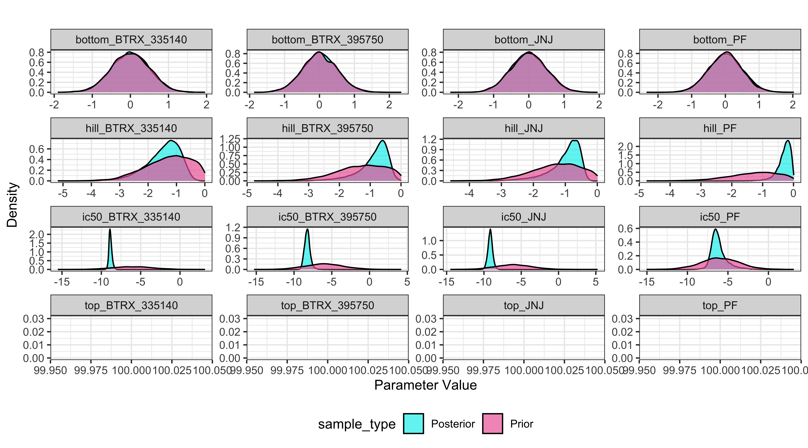

---
# For vignette -----------------------------------------------------------------
title: "Apply: Sigmoid Model -- KOR Antagonists"
subtitle: Analysis of Four Kappa Opioid Receptor Antagonists
description: Demonstrate the applying a sigmoid model electrophysiology data
# Document ---------------------------------------------------------------------
output: rmarkdown::html_vignette
vignette: >
  %\VignetteIndexEntry{Apply: Sigmoid Model -- KOR Antagonists}
  %\VignetteKeyword{BayesPharma}
  %\VignetteEngine{knitr::rmarkdown}
  %\VignetteEncoding{UTF-8}
  %\VignetteDepends{drc}

---


## Hill Equation {#sec-hill}

In this case study we are going to reanalyze the dose response of 4
Kappa Opioid receptor (KOR) antagonists using the \texttt{BayesPharma}
package from from a study done by Margolis et
al. (-@Margolis2020-bm). Whole cell electrophysiology in acute rat
midbrain slices was used to evaluate pharmacological properties of
four novel KOR antagonists: BTRX-335140, BTRX-395750, PF-04455242, and
JNJ-67953964

Originally in the paper the dose-response data analysis was done by using
the \texttt{drc} package in R which implements the minimization of negative
log likelihood function and reduces to least square estimation for a
continuous response. The data was normalized to % baseline then fit to
a 4-parameter log-logistic dose response model, setting the top (max
response) to 100% and estimating the IC50, its variance, and the
bottom (min response).

### Fitting the sigmoid model

Using the \texttt{BayesPharma} package, we can re-fit the sigmoid model with a
negative slope, and fixing the top parameter to \code{100} as the response is
normalized to a no-drug baseline.

For the prior, we are going to use a normal distribution because the
response values are continuous. First, we will run the analysis with
top (max response) parameter prior set to a constant value of 100
because top is normalized to \code{100} and the default broad prior for the \code{ic50},
\code{hill} and \code{bottom} parameters. Broad priors represent unbiased uncertainty and
provide an opportunity for extreme responses.

The level of informativeness of the prior will affect how much
influence the prior has on the model. Here is more [information on
prior choice
recommendations.](https://github.com/stan-dev/stan/wiki/Prior-Choice-Recommendations)

\scriptsize

```r
kor_prior <- BayesPharma::sigmoid_antagonist_prior(top = 100)
kor_prior
##            prior class coef group resp dpar  nlpar   lb   ub source
##  normal(-6, 2.5)     b                        ic50 <NA> <NA>   user
##    normal(-1, 1)     b                        hill <NA> 0.01   user
##    constant(100)     b                         top <NA> <NA>   user
##   normal(0, 0.5)     b                      bottom <NA> <NA>   user
```
\normalsize

#### Prior predictive checks
Following the Bayesian workflow, before fitting the model, it is good to check
the prior predictive distributions to see if they are compatible with the domain
expertise. So, before running the model, we will verify that the prior
distributions cover a plausible range of values for each parameter. To do this,
we want to  sample only from the prior distributions by adding
\code{sample_prior = "only"} as  an argument to the \code{sigmoid_model}
function. We will use the default response distribution of the model
(\code{family = gaussian()}).


\scriptsize

```r
kor_sample_prior <- BayesPharma::sigmoid_model(
  data = kor_antag |> dplyr::select(substance_id, log_dose, response),
  formula = BayesPharma::sigmoid_antagonist_formula(),
  prior = kor_prior,
  init = BayesPharma::sigmoid_antagonist_init(),
  sample_prior = "only")
```
\normalsize

And then plot of the prior predictive distributions:

\scriptsize

```r
kor_sample_prior |>
  BayesPharma::plot_density_distribution()
```


\normalsize

To sample from the model we will the \texttt{Stan} NUTs Hamiltonian Monte
Carlo, and initialize the parameters to the prior means to help with
model convergence, using the default values of \code{ec50 = -9}, \code{hill = -1},
\code{top = 100}, \code{bottom = 0}.

\scriptsize

```r
kor_model <- BayesPharma::sigmoid_model(
  data = kor_antag |> dplyr::select(substance_id, log_dose, response),
  formula = BayesPharma::sigmoid_antagonist_formula(
    predictors = 0 + substance_id), 
  prior = kor_prior,
  init = BayesPharma::sigmoid_antagonist_init())
```
\normalsize

### Analyzing model fit

The \texttt{brms} generated model summary shows the formula that the expected
response is sigmoid function of the log_dose with four parameters, and
a shared Gaussian distribution. Each parameter is dependent on the
substance_id. Since want to fit a separate model for each substance we
include a \code{0 +} to indicate that there is no common intercept.  The
consists of \code{73} data points and the posterior sampling was done in \code{4}
chains each with \code{8000} steps with \code{4000} steps of warm-up. The population
effects for each parameter summarize marginal posterior distributions,
as well as the effective sample size in the bulk and tail. This gives
an indication of the sampling quality, with an ESS of > \code{500} samples
being good for this type of model.

\scriptsize

```
##  Family: gaussian 
##   Links: mu = identity; sigma = identity 
## Formula: response ~ sigmoid(ic50, hill, top, bottom, log_dose) 
##          ic50 ~ 0 + substance_id
##          hill ~ 0 + substance_id
##          top ~ 0 + substance_id
##          bottom ~ 0 + substance_id
##    Data: data (Number of observations: 73) 
##   Draws: 4 chains, each with iter = 8000; warmup = 4000; thin = 1;
##          total post-warmup draws = 16000
## 
## Population-Level Effects: 
##                                Estimate Est.Error l-95% CI u-95% CI Rhat Bulk_ESS Tail_ESS
## ic50_substance_idBTRX_335140      -8.84      0.20    -9.20    -8.40 1.00    14883     8873
## ic50_substance_idBTRX_395750      -8.24      0.41    -8.92    -7.39 1.00    12333     5863
## ic50_substance_idJNJ              -9.15      0.32    -9.78    -8.50 1.00    17511    10242
## ic50_substance_idPF               -6.15      1.05    -7.64    -3.41 1.00     8649     6213
## hill_substance_idBTRX_335140      -1.47      0.60    -2.89    -0.59 1.00    15340    10545
## hill_substance_idBTRX_395750      -0.89      0.51    -2.24    -0.26 1.00    12763     6273
## hill_substance_idJNJ              -1.01      0.51    -2.38    -0.41 1.00    15285    11508
## hill_substance_idPF               -0.31      0.24    -0.88    -0.03 1.00     7904     4559
## bottom_substance_idBTRX_335140    -0.00      0.50    -0.99     0.97 1.00    19984    11491
## bottom_substance_idBTRX_395750     0.01      0.50    -0.97     1.00 1.00    19123    11247
## bottom_substance_idJNJ            -0.01      0.50    -0.98     0.98 1.00    18940    11984
## bottom_substance_idPF              0.00      0.50    -0.98     0.98 1.00    21351    12102
## top_substance_idBTRX_335140      100.00      0.00   100.00   100.00   NA       NA       NA
## top_substance_idBTRX_395750      100.00      0.00   100.00   100.00   NA       NA       NA
## top_substance_idJNJ              100.00      0.00   100.00   100.00   NA       NA       NA
## top_substance_idPF               100.00      0.00   100.00   100.00   NA       NA       NA
## 
## Family Specific Parameters: 
##       Estimate Est.Error l-95% CI u-95% CI Rhat Bulk_ESS Tail_ESS
## sigma    32.17      2.84    27.19    38.32 1.00    14690    10539
## 
## Draws were sampled using sampling(NUTS). For each parameter, Bulk_ESS
## and Tail_ESS are effective sample size measures, and Rhat is the potential
## scale reduction factor on split chains (at convergence, Rhat = 1).
```
\normalsize

#### Traceplot

The model ran without warning messages meaning there were no parameter
value problems or MCMC conflicts. The bulk and tail ESS indicate high
resolution and stability. The R-hat for each parameter equals \code{1.00} and
the \code{traceplot} shows the chains mixed well indicating the chains
converged.

\scriptsize

```r
kor_model |>
  bayesplot::mcmc_trace()
```


\normalsize

#### Compare prior and posterior marginal distributions

Displayed below is a plot for the prior and posterior distributions of
the parameters (prior is pink and posterior is teal). this can be
useful for comparing the density distribution of the prior and
posterior produced by the model:

\scriptsize

```r
BayesPharma::plot_prior_posterior_densities(
  model = kor_model,
  predictors_col_name = "substance_id",
  half_max_label = "ic50",
  title_label="")
```


\normalsize

Displayed below is a plot of the posterior distributions for each
parameter with the confidence intervals and mean. This is a useful
visual of the model results and to highlight the mode and high density
intervals:
  
\scriptsize

```r
BayesPharma::plot_posterior_density(
  kor_model, 
  predictors_col_name = "substance_id", 
  half_max_label = "ic50",
  title_label = "")
```


\normalsize

Displayed below is a plot of a sample of 100 sigmoid dose-response
curves from the posterior distribution (purple) and the median
quantile intervals:

\scriptsize

```r
BayesPharma::plot_posterior_draws(
  model = kor_model,
  title = "")
```


\normalsize

### Comparing alternative models

To test the sensitivity of the analysis to the prior, we can re-fit the model
with more informative prior:

\scriptsize

```
##              prior class coef group resp dpar  nlpar   lb   ub source
##  normal(-8.5, 0.5)     b                        ic50 <NA> <NA>   user
##    normal(-1, 0.5)     b                        hill <NA> 0.01   user
##      constant(100)     b                         top <NA> <NA>   user
##     normal(10, 15)     b                      bottom <NA> <NA>   user
```
\normalsize

Re-fitting the model

\scriptsize

\normalsize

## Comparing the Two Models Using LOO-Comparison:

One way to evaluate the quality of a model is for each data-point,
re-fit the model with remaining points, and evaluate the log
probability of the point in the posterior distribution. Taking the
expectation across all points give the Expected Log Pointwise
predictive Density (ELPD). Since this is computationally challenging
to re-fit the model for each point, if the model fits the data
reasonably well, then the ELPD can be approximated using the Pareto
smoothed importance sampling (PSIS). Using the LOO, the package,
Pareto k value for each data point is computed, where k less than \code{0.5}
is good, between \code{0.5} and \code{0.7} is OK, and higher than \code{0.7}
indicates the data point is not fit by the model well. Evaluating the model for
the KOR antagonists, shows that the model fits the data well.

\scriptsize

```
## No problematic observations found. Returning the original 'loo' object.
## NULL
```
\normalsize

Since ELPD is a global measure of model fit, it can be used to compare
models.  Using \code{loo_compare} from the LOO package, returns the
\code{elpd_diff} and \code{se_diff} for each model relative the model with the
lowest ELPD. The \code{kor_model2}, the model with more informative prior,
is the preferred model, but not significantly.

\scriptsize

```
## No problematic observations found. Returning the original 'loo' object.
##            elpd_diff se_diff
## kor_model2  0.0       0.0   
## kor_model  -0.8       1.2
```
\normalsize

##Analysis Using the drc Package

Here we will analyze the KOR antagonist data using the drc package and
compare it to the results from the \texttt{BayesPharma} analysis.

We will fix the top to \code{100} and fit the \code{ic50}, \code{hill}, and
\code{bottom}.

\scriptsize

```r
drc_models <- kor_antag |>
  dplyr::group_by(substance_id) |>
  dplyr::group_nest() |>
  dplyr::mutate(
    model = data |> 
      purrr::map(~drc::drm(
        response ~ log_dose,
        data = .x,
        fct = drc::L.4(fixed = c(NA, NA, 100, NA),
        names = c("hill", "bottom", "top", "ic50")))))

drc_models |>
  dplyr::mutate(summary = purrr::map(model, broom::tidy, conf.int = TRUE)) |>
  tidyr::unnest(summary) |>
  dplyr::arrange(term, substance_id) |>
  dplyr::select(-data, -model, -curve)
## # A tibble: 12 × 8
##    substance_id term   estimate std.error statistic  p.value  conf.low conf.high
##    <chr>        <chr>     <dbl>     <dbl>     <dbl>    <dbl>     <dbl>     <dbl>
##  1 BTRX_335140  bottom     1.31    19.4      0.0675 9.47e- 1  -40.0        42.6 
##  2 BTRX_395750  bottom    29.5      9.40     3.14   7.85e- 3    9.20       49.8 
##  3 JNJ          bottom   -18.1     26.7     -0.681  5.04e- 1  -73.7        37.4 
##  4 PF           bottom    39.4     30.8      1.28   2.22e- 1  -27.0       106.  
##  5 BTRX_335140  hill       4.06     9.20     0.441  6.65e- 1  -15.5        23.7 
##  6 BTRX_395750  hill       9.82   164.       0.0600 9.53e- 1 -344.        364.  
##  7 JNJ          hill       1.17     0.580    2.02   5.69e- 2   -0.0378      2.38
##  8 PF           hill       1.13     1.33     0.855  4.08e- 1   -1.73        4.00
##  9 BTRX_335140  ic50      -8.91     0.308  -28.9    1.42e-14   -9.57       -8.26
## 10 BTRX_395750  ic50      -8.97     0.505  -17.8    1.70e-10  -10.1        -7.88
## 11 JNJ          ic50      -8.77     0.670  -13.1    2.89e-11  -10.2        -7.37
## 12 PF           ic50      -7.96     1.27    -6.29   2.78e- 5  -10.7        -5.23
```
\normalsize

Displayed below is the comparison of results from \texttt{drc} and
\texttt{BayesPharma} for each parameter of the dose-response curve. Here we
see that the Bayesian method provides a distribution curve as evidence
and has smaller confidence intervals than most of the standard errors
provided by the \texttt{drc} method.


```
## Warning: Using `size` aesthetic for lines was deprecated in ggplot2 3.4.0.
## ℹ Please use `linewidth` instead.
## This warning is displayed once every 8 hours.
## Call `lifecycle::last_lifecycle_warnings()` to see where this warning was generated.
```


