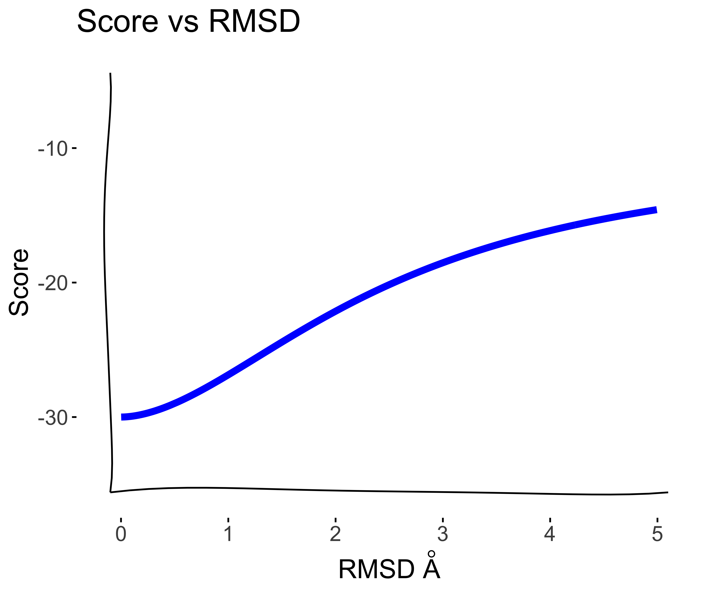
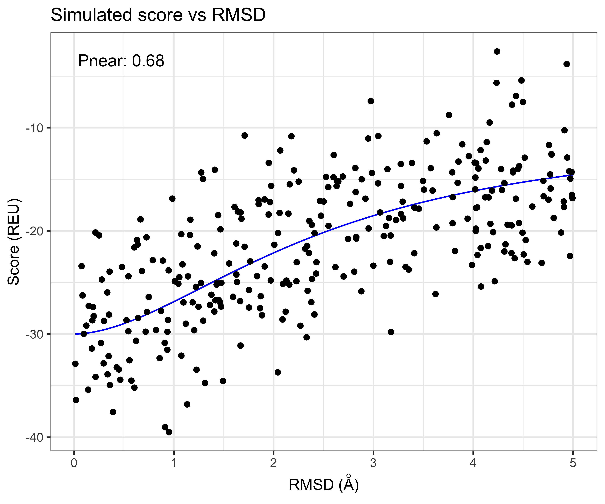
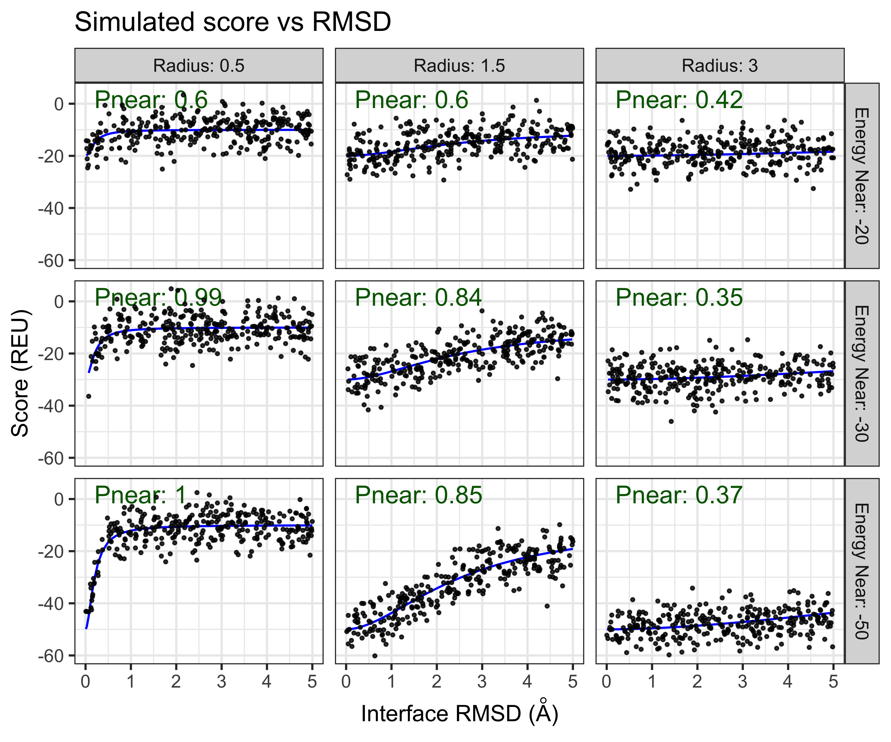
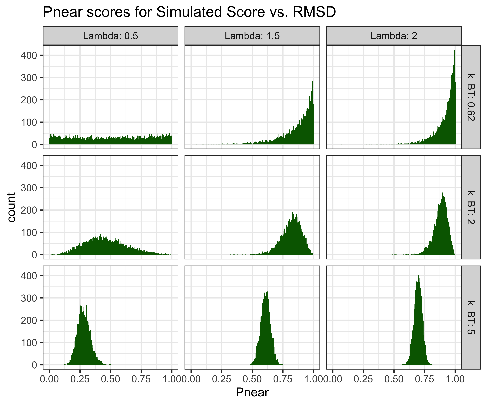
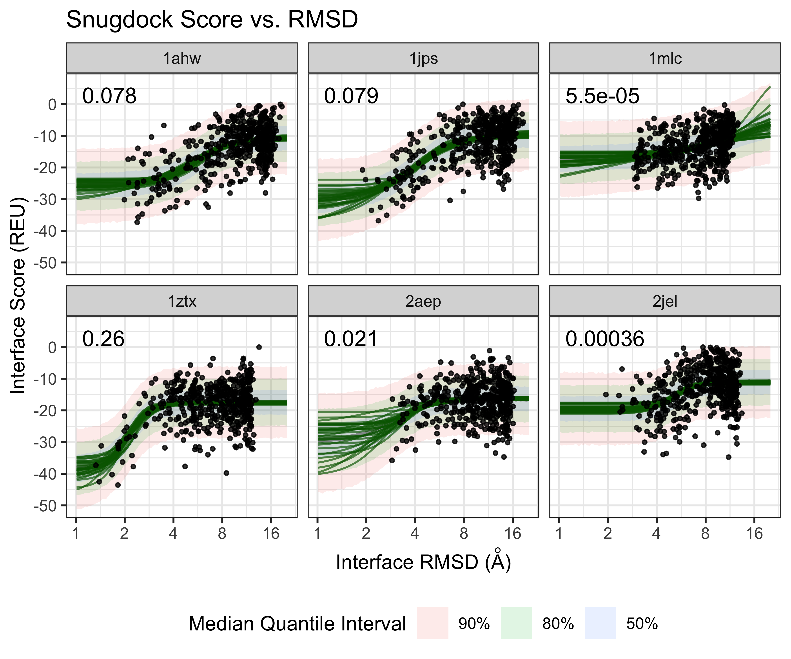
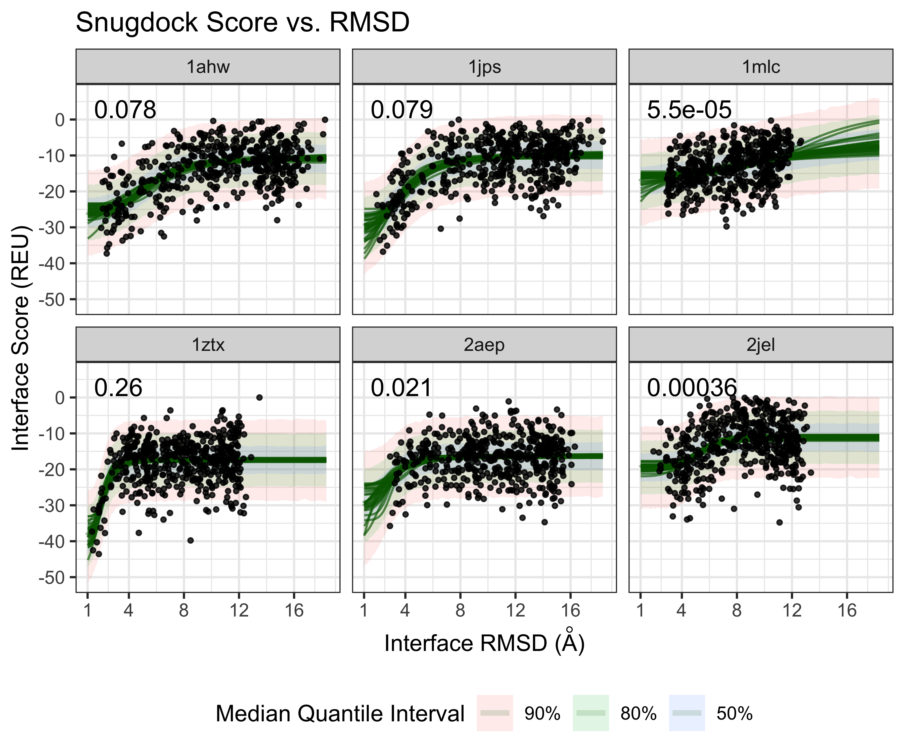

# Modeling Folding Funnels
A common task in molecular modeling is to predict the conformation of the folded
state for a given molecular system. For example, the Rosetta *ab initio*, or
protein-protein-interface docking protocols. To turn the simulation into a prediction
requires predicting the relative free energy of the folded state relative a reference.

The Rosetta score function can score individual conformations, but doesn't capture
the free energy of the state. Typically, a researcher will run a series of trajectories
and generate a **score vs. RMSD plot** and look for a "folding funnel" e.g. lower
energies for conformations that are closer to a target folded state. Here, RMSD
is the root-mean squared deviation measuring the euclidean distance of pairs of atom
defined by the application (for example just the backbone for sequence design or
interface atoms for docking).

## Pnear score
To quantify the quality of the folding funnel, recently, there has been interest
in using the **Pnear score**, which is defined by

    Pnear = Sum_i[exp(-RMSD[i]^2/lambda^2)*exp(-score[i]/k_BT)] /
            Sum_i[exp(-score[i]/k_BT)]

where *(RMSD[i], score[i])* is the score RMSD and score values for a
conformation *i*. The parameter *lambda* is measured in Angstroms indicating the
breadth of the Gaussian used to define "native-like-ness".  The bigger the
value, the more permissive the calculation is to structures that deviate from
native. Typical values for peptides range from 1.5 to 2.0, and for proteins from
2.0 to perhaps 4.0. And finally the parameter *k_BT* is measured in in energy
units, determines how large an energy gap must be in order for a sequence to be
said to favor the native state. The default value, 0.62, should correspond to
physiological temperature for ref2015 or any other scorefunction with units of
kcal/mol.

## Two state model
Thinking of the folded and unfolded states as a two-state model and RMSD as
a reaction coordinate or "collective variable", then the energy gap can be
modeled by a sigmoidal Boltzmann distribution.


```
## Warning in xkcd::theme_xkcd(): Not xkcd fonts installed! See
## vignette("xkcd-intro")
```

```
## Warning in theme_xkcd(): Not xkcd fonts installed! See vignette("xkcd-intro")
```

```
## Warning: Using `size` aesthetic for lines was deprecated in ggplot2 3.4.0.
## ℹ Please use `linewidth` instead.
## This warning is displayed once every 8 hours.
## Call `lifecycle::last_lifecycle_warnings()` to see where this warning was generated.
```



For a principled molecular dynamics or Monte Carlo simulation that maintains
detailed balance, it is in theory possible to use thermodynamic integration to
quantify the energy gap between the two states. However, this is often not 
computationally feasible for proteins of moderate size or in a protein design or
screening context where many different molecules need to be evaluated given a
limited computational budget. So, Instead, we will assume that the at least
locally around the folded state, the degrees of freedom increase exponentially
so that the log of the RMSD defines a linear reaction coordinate. 

If we simulate, trajectory points from the sigmoid on the log(RMSD) scale,
with a Normally distributed error we can generate synthetic score-vs-rmsd plots



A nice thing about having the parametric model to generate score-vs-rmsd plots,
is that it allows us to measure measure the sensitivity of the Pnear to differently
shaped score-vs-rmsd plots. For example we can scan both the radius of 



Another question we can use this model to investigate is how reproducible is the Pnear score?



# Antibody SnugDock Case study
As a case study, we can look at the real score-vs-rmsd plots from the Antibody
SnugDock scientific benchmark. It is evaluates the SnugDock protocol over 6
Antibody protein targets


We can use the fit the sigmoid model to the `log(RMSD)` using the
`BayesPharma` package, which relies on `BRMS` and `Stan`


Check the model parameter fit and estimated parameters:

```
##  Family: gaussian 
##   Links: mu = identity; sigma = identity 
## Formula: response ~ sigmoid(ec50, hill, top, bottom, log_dose) 
##          ec50 ~ 0 + target
##          hill ~ 0 + target
##          top ~ 0 + target
##          bottom ~ 0 + target
##    Data: data (Number of observations: 3003) 
##   Draws: 4 chains, each with iter = 4000; warmup = 2000; thin = 1;
##          total post-warmup draws = 8000
## 
## Population-Level Effects: 
##                   Estimate Est.Error l-95% CI u-95% CI Rhat Bulk_ESS Tail_ESS
## ec50_target1ahw       1.69      0.12     1.41     1.87 1.00     2877     1687
## ec50_target1jps       1.38      0.12     1.09     1.59 1.00     5373     4239
## ec50_target1mlc       2.40      0.52     0.99     3.20 1.00     3675     2475
## ec50_target1ztx       0.75      0.08     0.58     0.89 1.00     5291     3796
## ec50_target2aep       1.12      0.25     0.63     1.52 1.00     4585     2016
## ec50_target2jel       1.65      0.06     1.53     1.76 1.00     6534     5151
## hill_target1ahw       1.68      0.44     0.86     2.62 1.00     2528     1354
## hill_target1jps       1.51      0.36     0.91     2.33 1.00     4332     3997
## hill_target1mlc       1.03      0.56     0.25     2.30 1.00     3224     2761
## hill_target1ztx       2.71      0.55     1.74     3.89 1.00     6396     5073
## hill_target2aep       2.00      0.65     0.78     3.36 1.00     2210      725
## hill_target2jel       3.20      0.59     2.11     4.44 1.00     7223     4963
## top_target1ahw      -10.55      0.71   -11.57    -8.76 1.00     3500     2136
## top_target1jps       -9.70      0.57   -10.62    -8.36 1.00     5663     4538
## top_target1mlc       -1.19      5.99    -9.92    12.37 1.00     6721     4782
## top_target1ztx      -17.44      0.28   -17.99   -16.88 1.00     9559     5237
## top_target2aep      -16.32      0.57   -16.96   -15.49 1.00     2266      813
## top_target2jel      -11.10      0.34   -11.76   -10.41 1.00    10085     5363
## bottom_target1ahw   -26.09      2.40   -32.02   -23.13 1.00     2482     1411
## bottom_target1jps   -30.32      3.60   -39.13   -24.93 1.00     4782     3868
## bottom_target1mlc   -18.50      4.45   -32.03   -14.78 1.00     3071     2067
## bottom_target1ztx   -38.86      3.51   -46.78   -32.98 1.00     5433     4085
## bottom_target2aep   -30.29      5.95   -44.48   -21.19 1.00     5739     4435
## bottom_target2jel   -19.48      0.99   -21.59   -17.75 1.00     6529     4573
## 
## Family Specific Parameters: 
##       Estimate Est.Error l-95% CI u-95% CI Rhat Bulk_ESS Tail_ESS
## sigma     5.74      0.08     5.60     5.90 1.00    11394     5840
## 
## Draws were sampled using sampling(NUTS). For each parameter, Bulk_ESS
## and Tail_ESS are effective sample size measures, and Rhat is the potential
## scale reduction factor on split chains (at convergence, Rhat = 1).
```

Excitingly, using leave-one-out cross-validation, the sigmoid model fits the
data very well

```
## 
## Computed from 8000 by 3003 log-likelihood matrix
## 
##          Estimate   SE
## elpd_loo  -9521.2 39.0
## p_loo        21.4  1.1
## looic     19042.5 77.9
## ------
## Monte Carlo SE of elpd_loo is 0.1.
## 
## All Pareto k estimates are good (k < 0.5).
## See help('pareto-k-diagnostic') for details.
```


Visualize the fit as draws from the expected mean and median quantile intvervals on the
log(RMSD) scale:


And on the original RMSD scale:





## Quantify Pnear uncertainty
Using the two-state model fit, it is possible to propagate the posterior
uncertainty to estimate the uncertainty of the Pnear.


