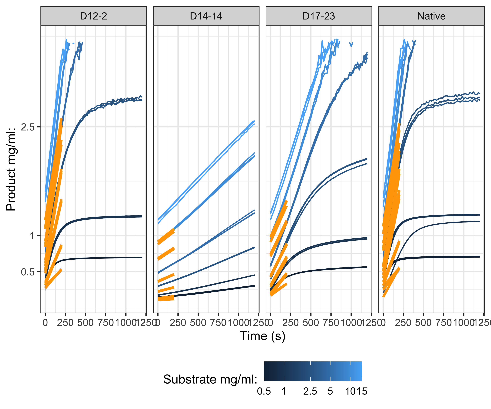
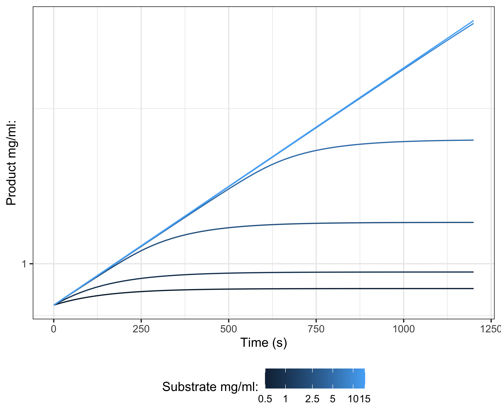

  


```
## Warning: There was 1 warning in `dplyr::mutate()`.
## ℹ In argument: `product_concentration = dplyr::case_when(...)`.
## Caused by warning:
## ! NAs introduced by coercion
```


```
## Warning: Removed 150 rows containing missing values (`geom_line()`).
```





```
## Compiling Stan program...
```

```
## Error in stanc(file = file, model_code = model_code, model_name = model_name, : 0
## 
## Semantic error in 'string', line 128, column 9 to column 71:
## 
## Ill-typed arguments supplied to function 'tQ_multiple'. Available signatures:
## (data vector, data vector, vector, vector, data vector, data vector) => vector
## 
## Instead supplied arguments of incompatible type: int[], vector, vector, vector, vector, vector.
```


```
## Error in update(model, sample_prior = "only"): object 'model' not found
```

```
## Error in tidybayes::tidy_draws(model_prior): object 'model_prior' not found
```

```
## Error in tidybayes::tidy_draws(model): object 'model' not found
```


```
## Error in tidyr::pivot_wider(draws_prior, id_cols = c(".chain", ".iteration", : object 'draws_prior' not found
```

```
## Error in tidyr::pivot_wider(draws_posterior, id_cols = c(".chain", ".iteration", : object 'draws_posterior' not found
```

```
## Error in fortify(data): object 'draws_prior_pairs' not found
```

