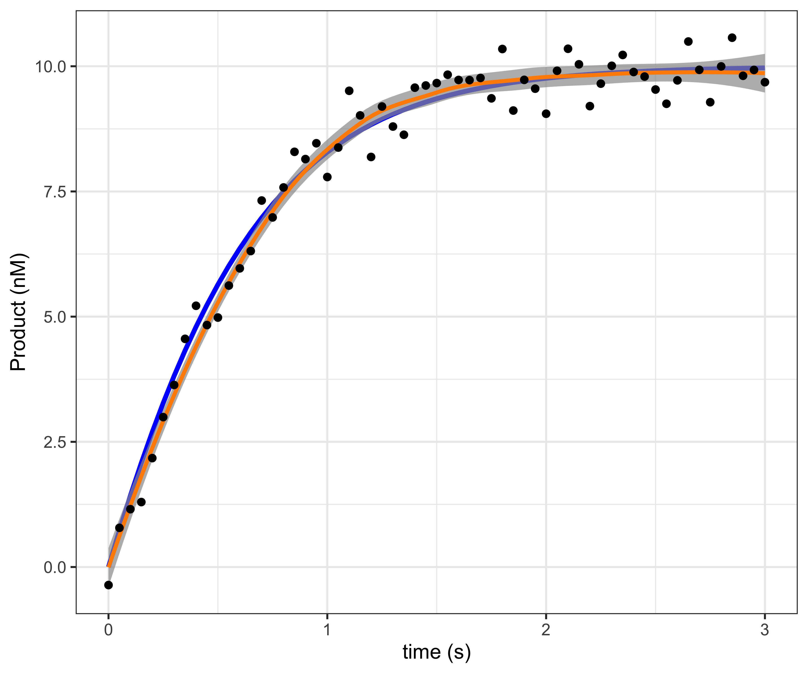
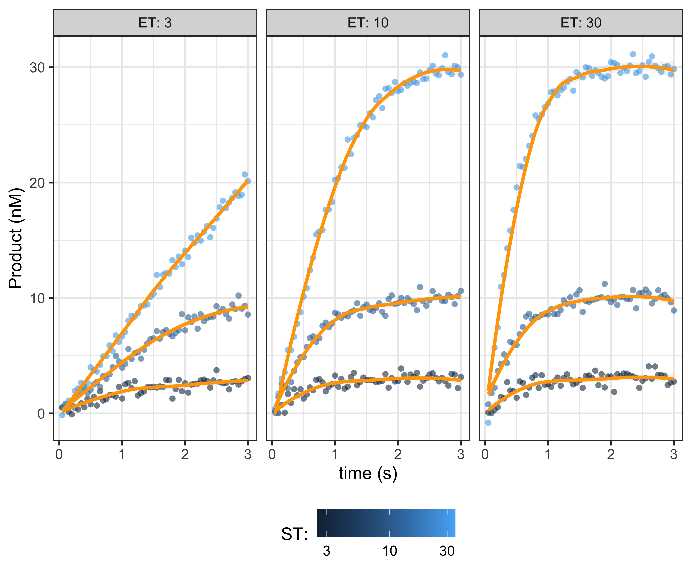

  


## Enzyme Kinetic Modeling
Enzymes are proteins that catalyze chemical reactions. Not only do they
facilitate producing virtual all biological matter, but they are crucial for
regulating biological processes. In the early 20th century Michaelis and Menten
described a foundational kinematic model for enzymes, where the substrate and
enzyme reversibly bind, the substrate is converted to the product and then
released.


                  kf
                 --->     kcat
          E + S  <---  C --->  E + P
                  kb

where the free enzyme (E) reversibly binds to the stubstrate (S) to form
a complex (C) with forward and backward rate constants of kf and kb, which is 
irreversibly catalyzed into the product (P), with rate constant of kcat,
releasing the enzyme to catalyze additional substrate. The total enzyme
concentration is defined to be the `ET := E + C`. The total substrate and
product concentration is defined to be `ST := S + C + P`. The Michaelis
constant is the defined to be the `kM := (kb + kcat) / kf`. The `kcat` rate
constant determines the maximum turn over at saturating substrate
concentrations, `Vmax := kcat * ET`. The rate constants `kcat` and `kM` can be
estimated by monitoring the product accumulation over time (enzyme progress
curves), by varying the enzyme and substrate concentrations.

By assuming that the enzyme concentration is very low (ET << ST), they derived
their celebrated Michaelis-Menten kinetics. Since their work, a number of groups
have developed models for enzyme kinetics that make less stringent assumptions.
Recently (Choi, et al., 2017), described a Bayesian model for the total QSSA
model. To make their model more accessible, we have re-implemented it in the
Stan/BRMS framework and made it available through the `BayesPharma` package.

## Outline for Vignette
Next we will formally define the problem and formulate the model as the
solution to an ordinary differential equation. To illustrate, we will consider a
a toy system where we assuming the `kcat` and `kM` are known and simulate a
sequence of measurements using deSolve. We will then implement the ODE in
Stan/BRMS using stanvars and show how the parameters of the toy system can be
estimated. Since it is common to vary the enzyme and substrate concentrations in
order to better estimate the kinematic parameters, we will show how we can
improve the Stan/BRMS model to allow multiple observations, each with an
arbitrary number of measurements. Then finally, we will consider a real enzyme
kinetics data set and use the Stan/BRMS model to estimate the kinematic
parameters. We will compare estimated parameters with those fit using
standard approaches.


## Problem Statement
Implement the total QSSA model in stan/BRMS, a refinement of the classical
Michaelis-Menten enzyme kinetics ordinary differential equation described in
(Choi, et al., 2017, DOI: 10.1038/s41598-017-17072-z). From their equation 2:

    Observed data:
      M     = number of measurements # The product concentration Pt is measured
      t[M]  = time                   # at M time points t
      Pt[M] = product                # 
      ST    = substrate total conc.  # Substrate and enzyme concentrations are
      ET    = enzyme total conc.     # assumed to be given for each observation

    Model parameters:
      kcat    # catalytic constant
      kM      # Michaelis constant

    ODE formulation:
      dPdt = kcat * (                # Change in product concentration at time t
        ET + kM + ST - Pt +          
        -sqrt((ET + kM + ST - Pt)^2 - 2* ET * (ST - Pt))) / 2
      initial condition:
        P := 0                       # There is zero product at time 0

In (Choi, et al. 2017) they prove, that the tQ model is valid when
 
     K/(2*ST) * (ET+kM+ST) / sqrt((ET+kM+ST+P)^2 - 4*ET(ST-P)) << 1,

where `K = kb/kf` is the dissociation constant.

## Simulate one observation
Using the `deSolve` package we can simulate data following the total QSSA model.
Measurements are made with random Gaussian noise with mean `0` and variance of
`0.5`.

``` r
tQ_model_generate <- function(time, kcat, kM, ET, ST){
  ode_tQ <- function(time, Pt, theta){
    list(c(theta[1] * (
      ET + theta[2] + ST - Pt +
      -sqrt((ET + theta[2] + ST - Pt)^2 - 4 * ET * (ST - Pt))) / 2))
  }
  deSolve::ode(y = 0, times = time, func = ode_tQ, parms = c(kcat, kM))
}

data_single <- tQ_model_generate(
  time = seq(0.00, 3, by=.05),
  kcat = 3,
  kM = 5,
  ET = 10,
  ST = 10) |>
  as.data.frame() |>
  dplyr::rename(P_true = 2) |>
  dplyr::mutate(
    P = rnorm(dplyr::n(), P_true, 0.5), # add some observational noise
    ST = 10, ET = 10)
head(data_single)
```

```
##   time    P_true           P ST ET
## 1 0.00 0.0000000 -0.08982865 10 10
## 2 0.05 0.7311578  1.34853281 10 10
## 3 0.10 1.4243598  1.43308014 10 10
## 4 0.15 2.0794197  1.73661838 10 10
## 5 0.20 2.6964485  2.78619356 10 10
## 6 0.25 3.2758537  3.17795634 10 10
```
To visualize, the true enzyme progress curve is shown in
<span style="color:blue">blue</span>, and the enzyme progress curve fit to the
noisy measurements with a smooth `loess` spline is shown in
<span style="color:orange">orange</span>. While the smooth fits well, we
cannot estimate the parameters for the curve from it.

```
## Warning: Using `size` aesthetic for lines was deprecated in ggplot2 3.4.0.
## ℹ Please use `linewidth` instead.
## This warning is displayed once every 8 hours.
## Call `lifecycle::last_lifecycle_warnings()` to see where this warning was generated.
```

<div class="figure" style="text-align: center">

<p class="caption">plot of chunk data-single-plot</p>
</div>

## Fitting a single ODE observation in BRMS

To implement in BRMS, we can use the `stanvars` to define custom functions. The
key idea is call the ODE solver, in this case the backward differentiation
formula (bdf) used to solve stiff ODEs, passing a function `ode_tQ` that
returns `dP/dt`, the change in product at time `t`. The `ode_tQ` function
depends on the product at time `t` as the state vector, the kinematic
parameters to be estimated `kcat` and `kM` and the user-provided data of the
enzyme and substrate concentrations `ET` and `ST`. To call `ode_dbf` we pass in
the initial product concentration and time (both equal to zero), measured
time-points, parameters and user defied data. Finally we, extract the vector of
sampled vector of product concentrations which we return.


``` r
stanvars_tQ_ode <- brms::stanvar(scode = paste("
vector tQ_ode(
   real time,
   vector state,
   vector params,
   data real ET,
   data real ST) {
   
   real Pt = state[1];   // product at time t
   real kcat = params[1];
   real kM = params[2];
   vector[1] dPdt;
   dPdt[1] = kcat * (
     ET + kM + ST - Pt
     -sqrt((ET + kM + ST - Pt)^2 - 4 * ET * (ST - Pt))) / 2;
   return(dPdt);
}
", sep = "\n"),
block = "functions")
```


``` r
stanvars_tQ_single <- brms::stanvar(scode = paste("
vector tQ_single(
  data vector time,
  vector vkcat,
  vector vkM,
  data vector vET,
  data vector vST) {
  
  vector[2] params = [ vkcat[1], vkM[1] ]';
  vector[1] initial_state = [ 0.0 ]';
  real initial_time = 0.0;
  int M = dims(time)[1];

  vector[1] P_ode[M] = ode_bdf(     // Function signature:
    tQ_ode,                         // function ode
    initial_state,                  // vector initial_state
    initial_time,                   // real initial_time
    to_array_1d(time),              // array[] real time
    params,                         // vector params
    vET[1],                         // ...
    vST[1]);                        // ...
  
  vector[M] P;                      // Need to return a vector not array
  for(i in 1:M) P[i] = P_ode[i,1];
  return(P);
}
", sep = "\n"),
block = "functions")
```

To use this function, we define `kcat` and `kM` as parameters and that
we wish to sample `P ~ tQ(...)`. Since all the data points define a single
observation, we set `loop = FALSE`. We use `gamma` priors for `kcat` and
`kM` with the shape parameter `alpha=4` and the rate parameter `beta=1`. The
prior mean is `alpha/beta = 4/1 = 4` and the variance is
`alpha/beta^2 = 4/1 = 4`. We also bound the parameters from below by `0`. We
initialize each chain at the prior mean and use `cmdstanr` version 2.29.2 as the
backend, and use the default warmup of `1000`


``` r
brms_params <- list(
  cores = 4,
  seed = 52L,
  backend = 'cmdstanr')
```


``` r
model_single <- do.call(what = brms::brm, args = c(list(
  formula = brms::brmsformula(
    P ~ tQ_single(time, kcat, kM, ET, ST),
    kcat + kM ~ 1,
    nl = TRUE,
    loop=FALSE),
  data = data_single |> dplyr::filter(time > 0),
  prior = c(
    brms::prior(prior = gamma(4, 1), lb = 0, nlpar = "kcat"),
    brms::prior(prior = gamma(4, 1), lb = 0, nlpar = "kM")),
  init = function() list(kcat = 4, kM = 4),
  stanvars = c(
    stanvars_tQ_ode,
    stanvars_tQ_single)),
  brms_params))
```

```
## Syntax error in '/var/folders/7z/yfz7cw1d0gs8lf1mzdgkv1pw0000gn/T/RtmpsyOm66/model-14253748bb373.stan', line 34, column 18 to column 19, parsing error:
##    -------------------------------------------------
##     32:    int M = dims(time)[1];
##     33:  
##     34:    vector[1] P_ode[M] = ode_bdf(     // Function signature:
##                            ^
##     35:      tQ_ode,                         // function ode
##     36:      initial_state,                  // vector initial_state
##    -------------------------------------------------
## 
## ";" expected after variable declaration.
## It looks like you are trying to use the old array syntax.
## Please use the new syntax:
## array[M] vector[1] P_ode;
```

```
## make[1]: *** [/var/folders/7z/yfz7cw1d0gs8lf1mzdgkv1pw0000gn/T/RtmpsyOm66/model-14253748bb373.hpp] Error 1
```

```
## Error: An error occured during compilation! See the message above for more information.
```
Fitting the model takes ~15 seconds, with `Rhat = 1` and
effective sample size for the bulk and tail greater than `1400` for
both parameters. The estimates and 95% confidence intervals are good.

```
## Error in eval(expr, envir, enclos): object 'model_single' not found
```

To visualize the posterior distribution vs. the prior distribution, we first
sample from the prior, using the same `brms::brm` call with
`sample_prior = "only"` the argument.

``` r
model_single_prior <- do.call(what = brms::brm, args = c(list(
  formula = brms::brmsformula(
    P ~ tQ_single(time, kcat, kM, ET, ST),
    kcat + kM ~ 1,
    nl = TRUE,
    loop=FALSE),
  data = data_single |> dplyr::filter(time > 0),
  prior = c(
    brms::prior(prior = gamma(4, 1), lb = 0, nlpar = "kcat"),
    brms::prior(prior = gamma(4, 1), lb = 0, nlpar = "kM")),
  init = function() list(kcat = 4, kM = 4),
  stanvars = c(
    stanvars_tQ_ode,
    stanvars_tQ_single),
  sample_prior = "only"),
  brms_params))
```

```
## Syntax error in '/var/folders/7z/yfz7cw1d0gs8lf1mzdgkv1pw0000gn/T/RtmpsyOm66/model-142534112e1ed.stan', line 34, column 18 to column 19, parsing error:
##    -------------------------------------------------
##     32:    int M = dims(time)[1];
##     33:  
##     34:    vector[1] P_ode[M] = ode_bdf(     // Function signature:
##                            ^
##     35:      tQ_ode,                         // function ode
##     36:      initial_state,                  // vector initial_state
##    -------------------------------------------------
## 
## ";" expected after variable declaration.
## It looks like you are trying to use the old array syntax.
## Please use the new syntax:
## array[M] vector[1] P_ode;
```

```
## make[1]: *** [/var/folders/7z/yfz7cw1d0gs8lf1mzdgkv1pw0000gn/T/RtmpsyOm66/model-142534112e1ed.hpp] Error 1
```

```
## Error: An error occured during compilation! See the message above for more information.
```

And to plot, we use `tidybayes` to gather the draws and `ggplot2` to map them to
curves, with the prior as the<span style="color:orange">orange curve</span>,
posterior as the <span style="color:blue">blue curve</span>, and the true
parameter marked as a vertical line.

```
## Error in eval(expr, envir, enclos): object 'model_single_prior' not found
```

```
## Error in eval(expr, envir, enclos): object 'model_single' not found
```


```
## Error in eval(expr, envir, enclos): object 'draws_single_prior' not found
```

Next, we plot the prior and posterior samples as a scatter plot. Note that
the high correlation of the `kcat` and `kM` parameters in the posterior. This is
expected, and typically better estimates require varying the enzyme and
substrate concentrations.

```
## Error in eval(expr, envir, enclos): object 'draws_single_prior' not found
```

```
## Error in eval(expr, envir, enclos): object 'draws_single_posterior' not found
```

```
## Error in eval(expr, envir, enclos): object 'draws_single_prior_pairs' not found
```

## Fitting multiple observations

Next we will extend the BRMS model to allow fitting common `kcat`, `kM`
concentrations based on multiple replicas, or varying substrate/enzyme
concentrations using BRMS. To demonstrate, we varying the enzyme and substrate
concentrations, to better fit the kinematic parameters.

``` r
data_multiple <- tidyr::expand_grid(
  kcat = 3,
  kM =  5,
  ET = c(3, 10, 30),
  ST = c(3, 10, 30)) |>
  dplyr::mutate(observation_index = dplyr::row_number()) |>
  dplyr::rowwise() |>
  dplyr::do({
    data <- .
    time <- seq(0.05, 3, by=.05)
    data <- data.frame(data,
      time = time,
      P = tQ_model_generate(
        time = time,
        kcat = data$kcat,
        kM = data$kM,
        ET = data$ET,
        ST = data$ST)[,2])
  }) |>
  dplyr::mutate(
    P = rnorm(dplyr::n(), P, 0.5))
```

<div class="figure" style="text-align: center">

<p class="caption">plot of chunk data-multiple-plot</p>
</div>


``` r
stanvars_tQ_multiple <- brms::stanvar(scode = paste("
vector tQ_multiple(
  array[] int replica,
  data vector time,
  vector vkcat,
  vector vkM,
  data vector vET,
  data vector vST) {

  int N = size(time);
  vector[N] P;
  int begin = 1;
  int current_replica = replica[1];
  for (i in 1:N){
    if(current_replica != replica[i]){
      P[begin:i-1] = tQ_single(
        time[begin:i-1],
        vkcat,
        vkM,
        vET[begin:i-1],
        vST[begin:i-1]);
      begin = i;
      current_replica = replica[i];
    }
  }
  P[begin:N] = tQ_single(time[begin:N], vkcat, vkM, vET[begin:N], vST[begin:N]);
  return(P);
}", sep = "\n"),
block = "functions")
```


``` r
model_multiple <- do.call(what = brms::brm, args = c(list(
  formula = brms::brmsformula(
    P ~ tQ_multiple(observation_index, time, kcat, kM, ET, ST),
    kcat + kM ~ 1,
    nl = TRUE,
    loop=FALSE),
  data = data_multiple,
  prior = c(
    brms::prior(prior = gamma(4, 1), lb = 0, nlpar = "kcat"),
    brms::prior(prior = gamma(4, 1), lb = 0, nlpar = "kM")),
  init = function() list(kcat = 4, kM = 4),
  stanvars = c(
    stanvars_tQ_ode,
    stanvars_tQ_single,
    stanvars_tQ_multiple)),
  brms_params))
```

```
## Syntax error in '/var/folders/7z/yfz7cw1d0gs8lf1mzdgkv1pw0000gn/T/RtmpsyOm66/model-142532f07ca55.stan', line 34, column 18 to column 19, parsing error:
##    -------------------------------------------------
##     32:    int M = dims(time)[1];
##     33:  
##     34:    vector[1] P_ode[M] = ode_bdf(     // Function signature:
##                            ^
##     35:      tQ_ode,                         // function ode
##     36:      initial_state,                  // vector initial_state
##    -------------------------------------------------
## 
## ";" expected after variable declaration.
## It looks like you are trying to use the old array syntax.
## Please use the new syntax:
## array[M] vector[1] P_ode;
```

```
## make[1]: *** [/var/folders/7z/yfz7cw1d0gs8lf1mzdgkv1pw0000gn/T/RtmpsyOm66/model-142532f07ca55.hpp] Error 1
```

```
## Error: An error occured during compilation! See the message above for more information.
```

``` r
model_multiple
```

```
## Error in eval(expr, envir, enclos): object 'model_multiple' not found
```


```
## Error in eval(expr, envir, enclos): object 'model_multiple' not found
```


```
## Error in eval(expr, envir, enclos): object 'model_multiple_prior' not found
```

```
## Error in eval(expr, envir, enclos): object 'model_multiple' not found
```


```
## Error in eval(expr, envir, enclos): object 'draws_multiple_prior' not found
```

```
## Error in eval(expr, envir, enclos): object 'draws_multiple_posterior' not found
```

```
## Error in eval(expr, envir, enclos): object 'draws_multiple_prior_pairs' not found
```


Next we will sample enzyme progress curves from the posterior


```
## Error in eval(expr, envir, enclos): object 'draws_multiple_posterior' not found
```

```
## Error in eval(expr, envir, enclos): object 'sample_multiple' not found
```


